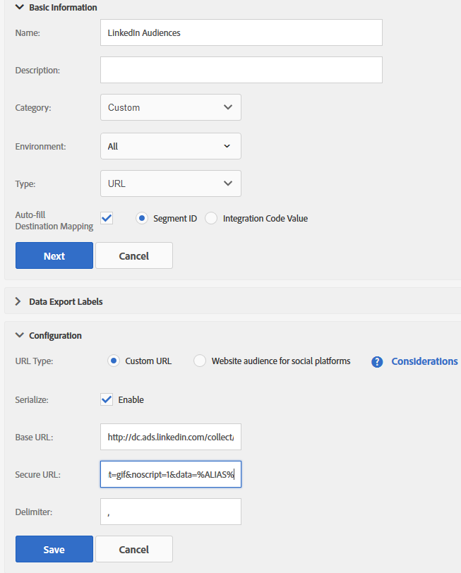

# Integração do AAM (Adobe Audience Manager) ao LinkedIn

Saiba como criar um Destino baseado em URL do LinkedIn no AAM (Adobe Audience Manager) para impulsionar segmentos do AAM para direcionamento de anúncios online.

## Descrição {#description}

### Ambiente

- Adobe Audience Manager (AAM)
- LinkedIn

### Problema/Sintomas

Segmentos de AAM criados na interface do AAM prontos para atribuir ao LinkedIn Destination. Consulte [Criar um segmento](https://experienceleague.adobe.com/docs/audience-manager/user-guide/features/segments/segment-builder.html#create-segment)no Guia do usuário do Audience Manager.

Este artigo é um guia para o processo de criação de um Destino baseado em URL do LinkedIn com a finalidade de enviar segmentos do Adobe Audience Manager (AAM) para o LinkedIn para direcionamento de anúncios online.

<b>Nota:</b> Esse método é uma solução alternativa oferecida para ajudá-lo a aproveitar os segmentos do AAM na plataforma LinkedIn. Quaisquer atualizações ou problemas na interface do usuário do LinkedIn devem ser abordados com o respectivo representante de conta da LinkedIn.

## Resolução {#resolution}

1. Crie um novo destino de URL no AAM chamado *Públicos da linkedIn* com as seguintes configurações (veja a captura de tela abaixo):
   <b>Informações básicas </b>

   - Ambiente: todos
   - Tipo: URL
   - Marque &quot;Preencher automaticamente o mapeamento de destino&quot; e selecione &quot;ID do segmento&quot;

   <b>Rótulos de exportação de dados</b>
Configuração opcional de acordo com suas necessidades
   <b>Configuração</b>

   - Tipo de URL: URL personalizado
   - Marque ‘Serializar’
   - URL base: será aqui que você informará o Pixel do LinkedIn

   <b>Exemplo</b>

   - *URL base:<b></b>[http://dc.ads.linkedin.com/collect/?pid=XXXXX&amp;fmt=gif&amp;noscript=1&amp;data=%ALIAS%](http://dc.ads.linkedin.com/collect/?pid=XXXXX&amp;amp;fmt=gif&amp;amp;noscript=1&amp;amp;data=%25ALIAS%25)<b>*
   - *URL seguro:</b><b>[https://dc.ads.linkedin.com/collect/?pid=XXXXX&amp;fmt=gif&amp;noscript=1&amp;data=%ALIAS%](https://dc.ads.linkedin.com/collect/?pid=XXXXX&amp;amp;fmt=gif&amp;amp;noscript=1&amp;amp;data=%25ALIAS%25)</b>*

   <b>Onde</b>

   - <b>*pid</b>* : é a ID do parceiro da LinkedIn
   - <b>*%ALIAS%</b>*: é uma macro AAM que será substituída dinamicamente pelas IDs de segmento AAM para as quais o usuário se qualifica, delimitadas pela vírgula &quot;,&quot;

   <b>Exemplo de Pixel disparado da página</b>
      <u><b><em><a href="https://dc.ads.linkedin.com/collect/?pid=51565&amp;fmt=gif&amp;noscript=1&amp;data=%25ALIAS%25" style="color:#0563c1; text-decoration:underline">https://dc.ads.linkedin.com/collect/?pid=51565&amp;fmt=gif&amp;noscript=1&amp;data=3401321,2993399,3263410</a></em></b></u>
      Este exemplo mostra um usuário que se enquadra em três segmentos ou IDs: 3401321, 2993399 e 3263410.
      <b>Exemplo de configuração de destino de URL</b>
   
2. Atribua o segmento aplicável ao destino recém-criado. O valor de mapeamento é preenchido automaticamente com a ID de segmento do AAM.
Informe uma data final, se aplicável, ou deixe em branco se não houver uma data final.
   

Agora, o AAM acionará seletivamente o pixel do LinkedIn, preenchendo a ID de segmento dinamicamente, qualificando o respectivo usuário para um Público-alvo no LinkedIn.
