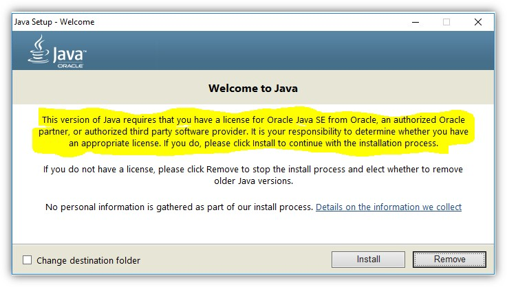

# Campaign Classic: Licenciamento Java

Saiba quem é responsável pelo licenciamento do Java em instâncias hospedadas/híbridas/no local.

## Descrição {#description}

### Ambiente

Campaign Classic

### Problema/Sintomas

Quem é responsável pelo licenciamento do Java em instâncias hospedadas/híbridas/no local?

## Resolução {#resolution}

A documentação do Adobe declara que o Java é um pré-requisito, portanto, a licença do Java deve ser fornecida a você.

OpenJDK também é suportado de acordo com [matriz de compatibilidade](https://experienceleague.adobe.com/docs/campaign-classic/using/release-notes/compatibility-matrix.html).
