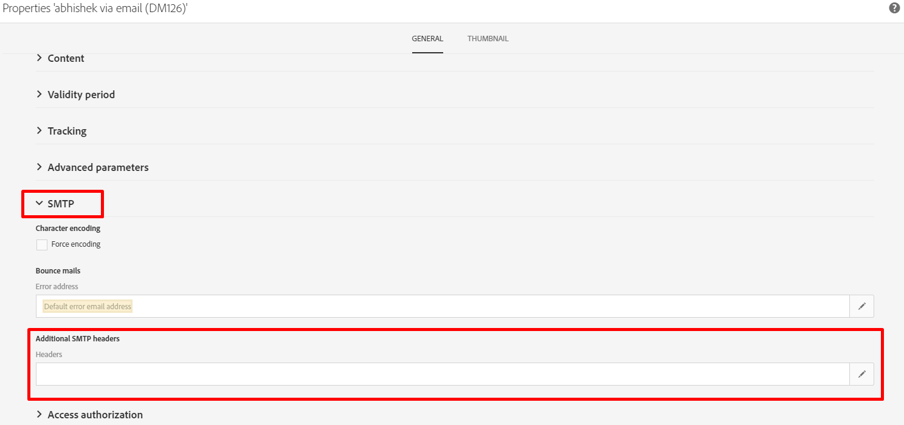

# O que é o cabeçalho List-Unsubscribe? E como isso pode ser implementado no ACS?

## Descrição

<b>O que é o cabeçalho List-Unsubscribe? </b>

O cabeçalho List-Unsubscribe é um cabeçalho de email opcional que pode ser adicionado às suas mensagens. Ela permite que os assinantes vejam um botão de cancelamento de inscrição, em que podem clicar se quiserem parar de receber automaticamente seu email.

List-Unsubscribe é usado por [!DNL Gmail], [!DNL Outlook.com]e outros. Ela tem como objetivo ajudar a reduzir reclamações, dando aos assinantes um método diferente para cancelar a assinatura com segurança, sem afetar negativamente sua reputação de envio.

O cabeçalho List-Unsubscribe é facilmente confundido com duas outras opções que os assinantes podem usar para cancelar a assinatura do seu email.

A opção List-Unsubscribe não é:

- O botão de spam: Quando o botão de lixo eletrônico ou spam é clicado, uma reclamação é acionada, o que afeta negativamente sua reputação de envio.
- O link de cancelamento de inscrição no anúncio de email: Esse link geralmente está no rodapé da sua criação de HTML e é controlado por você. No entanto, a funcionalidade List-Unsubscribe é controlada pelo provedor de caixa de correio, se você a tiver incluído em seus cabeçalhos.

Em outras palavras, pense na opção List-Unsubscribe como um terceiro método para os assinantes serem removidos da lista de endereçamento. E é uma opção que ajuda a proteger sua reputação ao reduzir potencialmente suas reclamações.

O cabeçalho de email List-Unsubscribe é definido na RFC 2369.

## Resolução

<b>E como isso pode ser implementado no ACS?</b>

No ACS, só é possível adicionar um cabeçalho SMTP no template do delivery (ele não pode ser adicionado diretamente no delivery).

Estas são as etapas a seguir:

1. Abra e edite as propriedades do template do delivery

1. Clique na seção SMTP e edite o [!UICONTROL Cabeçalhos] from [!UICONTROL Cabeçalhos SMTP adicionais]

   

1. Adicione a seguinte linha de comando

   ```
   List-Unsubscribe: mailto:bounce@subdomain?subject=unsubscribe%=escape(context.mimeMessageId)
   ```

   O endereço de email *<b>bounce@subdomain</b>* representa a variável <b>endereço returnpath</b>
