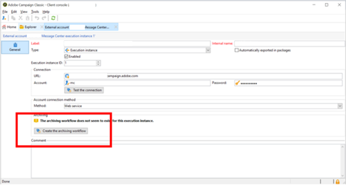

# Neolane process down Message Center, como recriar o fluxo de trabalho do MCSync

Os workflows que foram usados para sincronizar dados do *Instância de Execução do Centro de Mensagens* para o *Instância de controle* em builds mais antigas foram descontinuadas. Este artigo explica como criar novos workflows para sincronizar dados nas builds mais recentes.

## Descrição {#description}

### <b>Ambiente</b>

Adobe Campaign Classic

### <b>Problema</b>

Alguns dos processos de neolane estão inativos, como:

- Importação de quarentena (`quarantineSynch`)
- Importação de evento (`eventSynch`)
- Cálculo de custo (`budgetMgt`)

## Resolução {#resolution}

Os seis workflows que foram usados para sincronizar dados do *Instância de Execução do Centro de Mensagens* para *Instância de controle* nas builds mais antigas, foram descontinuadas nas builds mais recentes.

Esses workflows são:

1. Início da sincronização (`synchLaunch`)
2. Importação de evento (`eventSynch`)
3. Importação de qualificações de mensagem de entrega (`broadLogMsgSynch`)
4. Importação de logs de entrega de eventos (`broadLogSynch`)
5. Importação de URLs rastreados (`trackingUrlSynch`)
6. Importação de logs de rastreamento de eventos (`trackingLogSynch`)
7. Importação de quarentena (`quarantineSynch`)

Na build mais recente, novos workflows de arquivamento precisam ser criados para sincronizar os dados.

Siga estas etapas para fazer isso:

1. Vá para o *Conta Externa da Instância de Execução* e clique no link <b>Criar o fluxo de trabalho de arquivamento</b> botão.

   

   Ele criará um novo workflow do formulário &quot;`MCSync_<external account internal name>`&quot;.
2. Pare os workflows obsoletos antigos e comece a usar o novo workflow.
