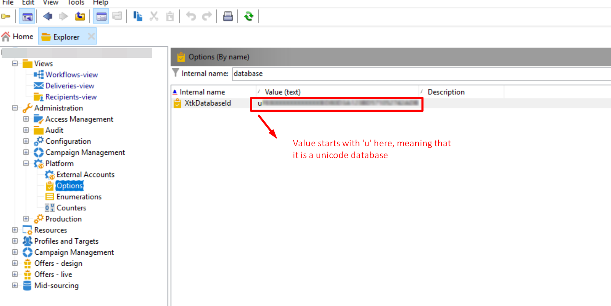

# A opção de codificação de caracteres SMTP dos conjuntos de caracteres do Campaign não está visível

## Descrição {#description}


<b>Ambiente</b>
Adobe Campaign Classic Adobe Campaign

<b>Problema</b>
Os conjuntos de caracteres na opção de codificação de caracteres SMTP do Adobe Campaign nas Propriedades de entrega não estavam visíveis.

<b>Causa</b>
A causa é que o banco de dados não é Unicode.


## Resolução {#resolution}


<b>Solução</b>

1. A variável `XtkDatabaseId` value in option field define a ID do banco de dados. Ele começa com um &quot;u&quot; para banco de dados Unicode. Consulte a [Lista de opções de Campaign Classic](https://experienceleague.adobe.com/docs/campaign-classic/using/installing-campaign-classic/appendices/configuring-campaign-options.html) na documentação do Campaign Classic no Adobe Experience League, para obter mais informações.


   
2. Isso significa que, se a ID do banco de dados for Unicode, você poderá exibir o seguinte:

   
3. Quando você altera a variável `XtkDatabaseId` no campo de opção, essa parte não fica visível como `IsUnicode()` parte da condição em não atender no código como abaixo:


```
container type="visibleGroup" visibleIf="EV(@messageType, 'mail') and IsUnicode()"
                     xpath="advancedParameters"
            container label="Character encoding" type="frame"
              input useDesc="true" xpath="@forceCodepage"/
              container type="visibleGroup" visibleIf="@forceCodepage"
                input xpath="@codepage"/
              /container
            /container
          /container
```


Neste exemplo, a colaboração do banco de dados foi &quot;Latin1_General_CI_AS&quot;. Assim, as suas `XtkDatabaseId` o valor no campo de opção não estava começando em u, e esse é o motivo pelo qual a parte não está visível.

Para obter mais informações sobre como alternar para Unicode em bancos de dados, consulte [Alternar para Unicode](https://experienceleague.adobe.com/docs/campaign-classic/using/monitoring-campaign-classic/updating-adobe-campaign/switching-to-unicode.html) na documentação do Campaign Classic no Adobe Experience League.
