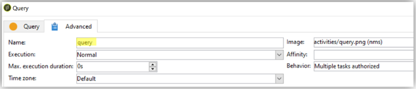

# Práticas recomendadas de fluxo de trabalho - configuração e monitoramento no Campaign Classic

Este artigo explica algumas práticas recomendadas relacionadas à configuração e ao monitoramento de workflows no Adobe Campaign Classic.

## Descrição {#description}

### <b>Ambiente</b>

- Adobe Campaign
- Adobe Campaign Classic

### <b>Problema</b>

Na maioria das vezes, os fluxos de trabalho fazem parte dos recursos principais (integrados ou personalizados) da plataforma. Por isso, é muito importante ter cuidado ao configurá-los.

## Resolução {#resolution}

### Configuração geral

#### Organização

Crie seus workflows, como importar na tabela XXX, em uma pasta personalizada.

Somente se o fluxo de trabalho genérico afetar toda a plataforma (limpeza, por exemplo), é possível considerar adicioná-lo no incorporado <b>Workflows técnicos</b> pasta.

#### Nome do fluxo de trabalho

Como explicado anteriormente, é muito importante dar nomes e rótulos adequados aos fluxos de trabalho. Como um operador nem sempre se referirá à documentação, preencha o campo <b>descrição</b> para resumir o processo a ser executado.

Se o fluxo de trabalho for parte de um processo que envolve vários fluxos de trabalho, sinta-se à vontade para ser explícito ao inserir um rótulo. Usar números é uma ótima maneira de organizar os fluxos de trabalho (por Rótulo). Por exemplo:

- 001 - Importar - Importação de recipients
- 002 - Importar - Importação de vendas
- 003 - Importar - Importar detalhes de vendas
- 010 - Exportar - Exportação de logs de entrega
- 011 - Exportar - Exportação de logs de rastreamento

#### Severidade

Configure a severidade de um workflow nas propriedades do workflow, na <b>Execução</b> guia:

- Normal
- Produção
- Crítico

Fornecer essas informações ao criar um fluxo de trabalho ajudará a entender a severidade do processo configurado.

#### Logs

O método JavaScript `logInfo()` O é uma ótima solução para depurar um fluxo de trabalho. É útil, mas deve ser usado com cuidado, especialmente para atividades executadas com frequência: pode sobrecarregar os logs e aumentar significativamente o tamanho da tabela de log.

Mas, também pode ser preciso de mais de `logInfo()`. Duas soluções adicionais estão disponíveis para ajudar.

<b>Manter o resultado de públicos provisórios entre duas execuções</b>

Essa opção, disponível nas propriedades do workflow&#39; <b>Geral</b> pode ser tão útil quanto perigoso. Isso impede que o Adobe Campaign exclua as tabelas temporárias criadas entre duas execuções. Embora possa ser útil para ambientes de desenvolvimento, é proibido usá-lo em ambientes de produção e ele deve ser monitorado. Manter tabelas temporárias pode resultar no aumento significativo do tamanho do banco de dados e, por fim, atingir o limite de tamanho. Além disso, o backup ficará lento.

<b>Nenhum fluxo de trabalho</b> em produção deve ter essa opção marcada a qualquer momento.

<b><u>Registrar consultas SQL no journal</u>:</b>

Disponível na <b>Execução</b> das propriedades do fluxo de trabalho, registrará todos as consultas SQL geradas pela ferramenta a partir das diferentes atividades. É uma ótima maneira de ver o que é realmente executado pela plataforma. No entanto, essa opção só deve ser usada temporariamente durante o desenvolvimento e não ativada na produção.

#### Monitoramento

Todos os workflows agendados que estão sendo executados em ambientes de produção devem ser monitorados para que um alerta seja enviado em caso de erro.

Nas propriedades do fluxo de trabalho, selecione uma <b>grupo supervisor</b>, seja o &quot;Workflow supervisors&quot; padrão ou um grupo personalizado. Certifique-se de que pelo menos um operador pertença a esse grupo, com um email configurado.

<b><u>Não deixe os workflows pausados</u>:</b>

Se criar um workflow temporário, certifique-se de que ele será concluído corretamente e não permanecerá no estado &quot;paused&quot;. Se estiver pausado, isso significa que é necessário manter as tabelas temporárias e, portanto, aumentar o tamanho do banco de dados.

### No fluxo de trabalho

#### Nome da atividade

Ao desenvolver seu fluxo de trabalho, todas as atividades terão um nome, assim como todos os objetos do Adobe Campaign. Embora o nome seja gerado pela ferramenta, recomendamos que você renomeie com um nome explícito ao configurá-lo. O risco de fazer isso depois é que pode interromper o workflow com atividades usando o nome de outra atividade anterior. Portanto, seria um trabalho difícil atualizar os nomes depois.

O nome da atividade pode ser encontrado no <b>Avançado</b> guia. Não use nomes como query, query1, query11, mas nomes explícitos como `querySubscribedRecipients`. Esse nome aparecerá no journal e, se aplicável, nos logs SQL, e isso ajudará a depurar o workflow ao configurá-lo.

#### JavaScript em uma atividade

Você pode adicionar JavaScript ao inicializar uma atividade de workflow. Isso pode ser feito nas configurações de <b>Avançado</b> guia. Para facilitar a identificação do workflow, recomendamos usar traços duplos no início e no fim do rótulo da atividade da seguinte maneira: *— Meu rótulo —*

#### Sinal

Na maioria das vezes, você não saberá de onde o sinal é chamado. Para evitar esse problema, use o <b>Comentário</b> campo dentro do <b>Avançado</b> da atividade signal para documentar a origem esperada de um sinal para esta atividade.

#### Atualização de workflow

Um workflow de produção não deve ser atualizado diretamente. A menos que o processo consista na criação de uma campanha com workflows de modelo, os processos devem ser testados primeiro em um ambiente de desenvolvimento, se possível. Somente após essa validação é que o fluxo de trabalho pode ser implantado e iniciado na produção.

Os workflows arquivados podem ser mantidos em plataformas de desenvolvimento ou teste, em um <b>Arquivado</b> pasta, mas a produção deve permanecer o mais limpa possível. Os workflows antigos devem ser removidos da produção se estiverem inativos.
