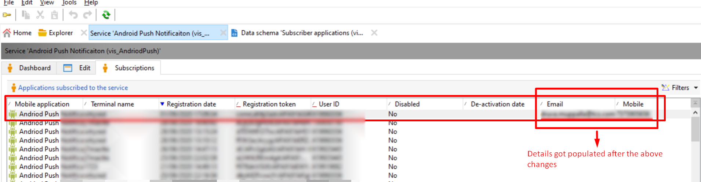

# Parâmetros adicionais não estão sendo preenchidos no apsubscription Rcp ACC

## Descrição

Nós estendemos a tabela Rcp de assinatura do aplicativo. Quando tentamos inserir valores usando pares de valores chave usando parâmetros adicionais em métodos de dispositivo de registro, apenas o token do dispositivo e a chave do usuário são atualizados. Por favor, verifique isso e nos aconselhe sobre por que os dados não estão sendo preenchidos.

## Resolução

Como vimos, ao adicionar os parâmetros adicionais no aplicativo móvel &quot;Serviços e assinaturas&quot;, pudemos preencher os detalhes de email e número de telefone.

