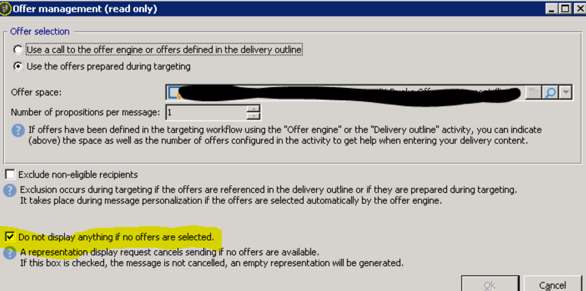

# Campaign Classic V7 - Erro de mensagem cancelada (representação indisponível) no delivery

## Descrição

Abaixo é exibida a mensagem de erro ao enviar um delivery de email:

*Mensagem cancelada (representação indisponível)*

Captura de tela de resolução abaixo: 

## Resolução

A caixa &quot;Do not display anything if no offers are seleted&quot; deve ser marcada no gerenciamento de ofertas de delivery (um pequeno ícone presente na barra superior do delivery) para resolver o problema.
