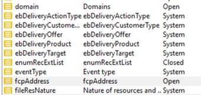

# Enumerações de emoticons

## Descrição

<b>Ambiente</b>
- Campaign Classic
- Campaign
- Campaign Standard

<b>Problema/Sintomas</b>
De acordo com a [seguindo](https://experienceleague.adobe.com/docs/campaign-classic/using/sending-messages/personalizing-deliveries/customizing-emoticon-list.html?lang=en#add-new-emoticon) documento, podemos ter a lista de emoticons OOTB em Enumerações.
[https://experienceleague.adobe.com/docs/campaign-classic/using/sending-messages/personalizing-deliveries/customizing-emoticon-list.html?lang=en#add-new-emoticon](https://experienceleague.adobe.com/docs/campaign-classic/using/sending-messages/personalizing-deliveries/customizing-emoticon-list.html?lang=en#add-new-emoticon)

Mas o usuário não vê essa lista. Existe algum pacote que precisa ser instalado ou algo mais que precisa ser configurado?

## Resolução

Este foi um novo recurso introduzido em 1978. Confira o [Notas de versão](https://experienceleague.adobe.com/docs/campaign-classic/using/release-notes/previous-releases/release--20-2.html?lang=en#release-20-2-1-build-9178) na documentação do Experience League para obter mais informações.

Observe que o usuário precisa estar na mesma versão do console que a compilação do servidor para expor o menu de emoticons.
