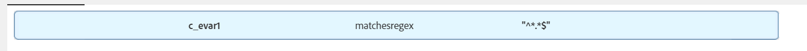

# Crie uma característica para capturar todos os valores em uma variável c_evar1

## Descrição

   Como criar uma característica para capturar todos os valores recebidos no AAM?   

## Resolução

Isso é possível com a ajuda de &quot;Expressões regulares&quot;.

Uma condição como &quot;(c_evar1 corresponde a chesregex &quot;\*.\*$&quot;)&quot; criaria uma característica para capturar todos os valores que entram em AAM. Isso atuará como &quot;se c_evar1 existir&quot;.

