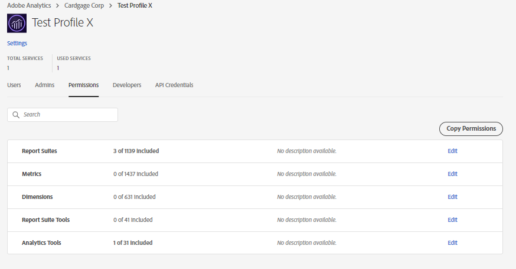

# Pré-requisito para disponibilizar um perfil de produto ao compartilhar um projeto do Workspace

## Descrição {#description}

<b>Ambiente</b>
- Customer Journey Analytics
- Analytics

<b>Problemas/Sintomas</b>
Um perfil de produto informa que &quot;X&quot; pode não estar disponível no menu suspenso ao compartilhar um projeto do espaço de trabalho com usuários de &quot;X&quot;.

## Resolução {#resolution}

Para que um Perfil de produto fique disponível no menu suspenso enquanto estiver compartilhando um projeto do espaço de trabalho, ele deve ter/ter tido qualquer permissão do Analytics associada a ele no Admin Console. Depois que qualquer permissão aleatória for adicionada ao Perfil &quot;X&quot; do produto, o usuário deverá começar a vê-la na lista suspensa enquanto compartilha qualquer projeto do Workspace.

No exemplo acima - O Perfil de produto &#39;Perfil de teste X&#39; não estava disponível na opção suspensa quando foi recém-criado sem permissões. No entanto, quando adicionamos permissões, elas ficaram disponíveis.

<b>Nota:</b> Se todas as permissões atribuídas ao Perfil de produto &#39;X&#39; forem revogadas no Admin Console, o perfil de produto &#39;X&#39; será <b>ainda </b>continue disponível na lista suspensa para compartilhar o projeto.

     
