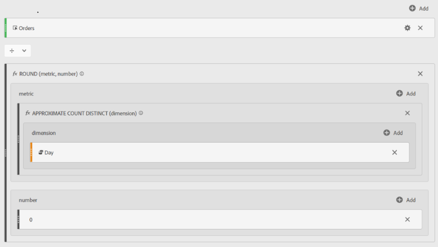

# Média de pedidos diários no Adobe Analytics

## Descrição

Métrica calculada para localizar Pedidos médios diários no Adobe Analytics

## Resolução

<u><b>ISENÇÃO DE RESPONSABILIDADE</b></u>: A métrica personalizada abaixo usa o[!UICONTROL Contagem distinta aproximada]&quot;. Como o nome sugere, essa não é uma métrica 100% precisa, no entanto, é garantido que o resultado estará dentro de 5% do valor real em 95% das vezes.

