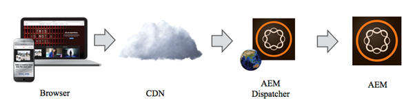

# Otimização dos caches do site do AEM

Otimizar o armazenamento em cache na arquitetura AEM é uma das maneiras mais rápidas de obter um grande aumento de desempenho. Este artigo se concentra em explicar como otimizar os vários caches disponíveis em uma arquitetura de AEM.

## Descrição {#description}

### Ambiente

Adobe Experience Manager

### Problemas/Sintomas

Como otimizar os caches do site do AEM?

#### <u>Arquitetura e armazenamento em cache do AEM</u>

Em todas as arquiteturas AEM, o usuário encontra várias camadas de cache ao visitar seu site. Há quatro camadas de cache a serem consideradas em uma arquitetura AEM padrão. Isso inclui as instâncias de Navegador da Web, CDN, Dispatcher e AEM.

## Resolução {#resolution}

### A. Armazenamento em cache do navegador

O primeiro nível de cache que um usuário encontra em uma visita repetida do site é o próprio navegador. O armazenamento em cache no nível do navegador geralmente é feito por meio de [<b>Cache-Control: max-age=...</b>](https://developer.mozilla.org/en-US/docs/Web/HTTP/Headers/Cache-Control) resposta [cabeçalho](https://developer.mozilla.org/pt-BR/docs/Web/HTTP/Headers). A variável <b>max-age</b> Essa configuração informa ao navegador por quantos segundos o arquivo deve ser armazenado em cache antes de tentar &quot;revalidar&quot; ou solicitá-lo do site novamente. Esse conceito de cache <b>max-age</b> geralmente é chamado de &quot;Expiração de cache&quot; ou TTL (&quot;Time to Live&quot;).

Existem várias opções (ou &quot;diretivas&quot;) dentro do <b>Controle de cache</b> que afetam como ocorre o armazenamento em cache. Estas são algumas diretivas comuns:

1. private — a diretiva private no cabeçalho Cache-Control a torna de forma que o arquivo seja armazenado em cache somente no navegador, não em caches intermediários, como CDNs. Um uso prático para essa diretiva seria se sua página incluísse conteúdo personalizado/específico do usuário.

   Exemplo de uso: `Cache-Control: max-age=300, private`
2. s-maxage - a diretiva s-maxage no cabeçalho Cache-Control permite definir um TTL diferente para caches compartilhados, como CDNs. Quando esse valor for definido, o navegador usará o que está definido em max-age e outros caches respeitarão a configuração s-maxage.

   Exemplo de uso: `Cache-Control: max-age=600, s-maxage=300`

Todos os navegadores modernos são compatíveis com o <b>Controle de cache</b> No entanto, alguns cabeçalhos obsoletos antigos existem a partir de HTTP/1.0, o que ainda pode ter efeito no armazenamento em cache. Esses cabeçalhos são <b>[Expira](https://developer.mozilla.org/en-US/docs/Web/HTTP/Headers/Expires)</b> e <b>[Pragma](https://developer.mozilla.org/pt-BR/docs/Web/HTTP/Headers/Pragma)</b>. Se você não precisar de suporte a navegadores muito antigos, não envie esses cabeçalhos de resposta.

Além do armazenamento em cache, a revalidação também é um conceito importante. A revalidação depende da <b>[Última modificação](https://developer.mozilla.org/en-US/docs/Web/HTTP/Headers/Last-Modified)</b>([resposta](https://developer.mozilla.org/en-US/docs/Glossary/Response_header)) / <b>[Se modificado desde](https://developer.mozilla.org/en-US/docs/Web/HTTP/Headers/If-Modified-Since)</b> ([solicitação](https://developer.mozilla.org/en-US/docs/Glossary/Request_header)), e a variável <b>[ETag](https://developer.mozilla.org/en-US/docs/Web/HTTP/Headers/ETag)</b> (resposta) / <b>[If-None-Match](https://developer.mozilla.org/pt-BR/docs/Web/HTTP/Headers/If-None-Match)</b> (solicitação) cabeçalhos.

<b>Cuidado em testes de navegador:</b>

Ao testar o armazenamento em cache no Google Chrome, se você estiver testando em https e tiver um certificado autoassinado, nada será armazenado em cache. O Chrome não armazena em cache respostas ou executa revalidação quando há um certificado não confiável ou inválido.

<b>Observação sobre o dispatcher:</b>

Há um problema com o AEM Dispatcher v4.2.3 e versões anteriores em que o `/enableTTL` somente caches que usam <b>max-age</b> diretiva. Isto significa que, mesmo quando <b>privado</b> ou <b>s-maxage</b> diretivas são definidas ainda armazenaria em cache se <b>max-age</b> está definido. Esse problema é resolvido no Dispatcher 4.2.4 e nas versões posteriores.

### B. Armazenamento em cache do CDN

A [CDN ou &quot;Rede de entrega de conteúdo&quot;](https://en.wikipedia.org/wiki/Content_delivery_network)O, é uma rede distribuída de servidores da Web projetada para armazenar em cache e veicular conteúdo do local mais próximo aos usuários. Isso reduz os saltos de rede e a distância do computador do usuário ao seu conteúdo, reduzindo, assim, [&quot;Tempo de viagem de ida e volta&quot; (RTT)](https://en.wikipedia.org/wiki/Round-trip_delay_time). RTT é o tempo que leva para o navegador enviar uma solicitação ao seu site e receber uma resposta. A concorrência no espaço do provedor de CDN tornou os CDNs muito econômicos. Isso torna fácil a decisão de usar um CDN para seu site. <b>Se você ainda não estiver usando um CDN, deverá incorporar definitivamente um CDN ao seu site.</b>

Há muitos provedores de CDN, cada um oferece diferentes recursos e configurações.

<b>Como funciona o armazenamento em cache do CDN?</b>

As CDNs armazenam conteúdo em cache seguindo regras semelhantes aos navegadores. Eles dependem do <b>[Controle de cache](https://developer.mozilla.org/pt-BR/docs/Web/HTTP/Headers/Cache-Control)</b> HTTP [resposta](https://developer.mozilla.org/en-US/docs/Glossary/Response_header) cabeçalho e geralmente retornam ao <b>[Expira](https://developer.mozilla.org/en-US/docs/Web/HTTP/Headers/Expires)</b> cabeçalho se não <b>Controle de cache</b> cabeçalho encontrado.

A maioria dos CDNs fornece alguma maneira de acionar uma liberação manual do cache.  Em muitos casos, as liberações de cache têm algum atraso (por exemplo, 15 minutos) em relação à propagação para todos os servidores de borda que têm seus arquivos.

<b>Otimização do uso do CDN</b>

Há algumas coisas a serem feitas para garantir que você esteja armazenando arquivos em cache de maneira ideal na CDN:

1. Use uma CDN compatível com o <b>stale-while-revalidate</b> e <b>stale-if-error</b> diretivas na <b>Controle de cache</b>cabeçalho.
   - <b>stale-while-revalidate</b> - esta diretiva informa à CDN para fornecer a versão antiga (já armazenada em cache) do arquivo, enquanto recupera uma nova após a expiração do arquivo de cache.
   - <b>stale-if-error</b> - da mesma forma, essa diretiva informa ao CDN para fornecer a versão antiga (já armazenada em cache) do arquivo quando a origem responder com um erro durante a revalidação.
2. Respostas de compactação GZip para todos os tipos de arquivos que não são pré-compactados.

   Você deve fazer isso no nível do dispatcher. Isso garantirá que você reduza o número de bytes enviados para o CDN. As CDNs normalmente cobram por bytes transferidos, de modo que a compactação de respostas reduz o custo.

   - Ativar a compactação GZip no nível do Dispatcher: Apache - [usar mod_deflate](https://httpd.apache.org/docs/2.4/mod/mod_deflate.html). Tenha cuidado para o uso da Vary por mod_deflate. Em certos casos, o cabeçalho Vary pode fazer com que o CDN e o Navegador ignorem totalmente o armazenamento em cache.
   - Microsoft IIS - use [Compactação dinâmica](https://docs.microsoft.com/pt-br/iis/configuration/system.webserver/httpcompression/).
   - Não permita a compactação gzip de arquivos grandes ou arquivos que já estejam compactados. Observe que a maioria dos formatos de imagem e vídeo já está pré-compactada. Compactá-los dinamicamente no nível do servidor da Web tem um custo muito alto para o desempenho.
      - No Apache, isso pode ser feito por meio da diretiva AddOutputFilterByType: AddOutputFilterByType DEFLATE text/html text/plain text/xml text/css text/javascript application/javascript
      - No IIS, isso pode ser controlado pelo `<` dynamicTypes`>`  configuração.
   - Se o provedor de CDN oferecer suporte a [Inclusões da borda](https://en.wikipedia.org/wiki/Edge_Side_Includes) (ESI) em seguida, utilize esse recurso. Os componentes do AEM podem ser quebrados usando ESI. Para fazer isso, use o Apache [`\[` Sling Dynamic Includes`\]`](https://github.com/Cognifide/Sling-Dynamic-Include) ou implementar uma solução personalizada. É útil quando você tem páginas bastante estáticas, mas está disponibilizando conteúdo mais dinâmico em algumas partes da página. Nesses casos, você está quebrando a página em vários arquivos CDN. Dessa forma, você pode armazenar em cache diferentes partes da página por diferentes períodos.

<b>Provedores de CDN populares</b>

Veja a seguir uma lista de alguns provedores de CDN populares:

- [CDN do Microsoft Azure](https://docs.microsoft.com/en-us/azure/cdn/cdn-overview)
- [Amazon CloudFront](https://aws.amazon.com/cloudfront/)
- [Akamai](https://www.akamai.com/br/pt/)
- [CDN da Google Cloud](https://cloud.google.com/cdn/docs/)
- [CDN do Rackspace](https://www.rackspace.com/en-us/cloud/cdn-content-delivery-network)
- [Stackpath CDN (anteriormente conhecido como Max CDN)](https://www.stackpath.com/products/cdn/)
- [Cloudflare](https://www.cloudflare.com/cdn/)
- [Fastly](https://www.fastly.com/)
- [F5 Redes CDN](https://f5.com/glossary/content-delivery-network-cdn)

Há várias outras, cada uma com diferentes recursos.

<b>Atenção:</b>

Tenha cuidado com o [Variar](https://developer.mozilla.org/en-US/docs/Web/HTTP/Headers/Vary) cabeçalho de resposta. Em certos casos, <b>Variar</b> pode fazer com que o CDN e o navegador ignorem totalmente o cache. Como regra geral, evite adicionar <b>Variar</b> exceto para <b>Vary: Accept-Encoding</b> (aplicado somente quando a resposta é compactada por gzip). Em outras palavras, se você precisar &quot;variar&quot; a saída de uma resposta, use um URL diferente.

Por exemplo, se você tiver uma versão diferente do HTML para dispositivos móveis ou desktop, use um URL diferente. Isso permitirá que CDNs e navegadores armazenem em cache com mais eficiência.

### C. Armazenamento em cache do Dispatcher do AEM

Se o cache do CDN tiver expirado, a solicitação alcançará o cache do dispatcher do AEM. Nesse nível, há muitas coisas que podem ser feitas para otimizar o armazenamento em cache.

Como este é um tópico maior, consulte [este artigo](https://helpx.adobe.com/mt/experience-manager/kb/cache-problems-on-chrome-with-SSL-certificate-errors.html) para obter detalhes sobre como otimizar o cache do dispatcher.

### D. Instâncias de publicação do AEM

No nível do AEM, há algumas coisas que devem ser feitas para otimizar as várias camadas de cache:

1. Defina os seguintes cabeçalhos de resposta HTTP que não são definidos por AEM por padrão.
   1. <b>[Cache-Control: max-age=...](https://developer.mozilla.org/pt-BR/docs/Web/HTTP/Headers/Cache-Control)</b> - Para definir esse cabeçalho, [ACS Commons - Dispatcher TTL](https://adobe-consulting-services.github.io/acs-aem-commons/features/dispatcher-ttl/index.html) poderia ser usado ou você poderia implementar um código personalizado para configurá-lo.
   2. <b>[Última modificação](https://developer.mozilla.org/en-US/docs/Web/HTTP/Headers/Last-Modified)</b> - Se o conteúdo da página for relativamente estático, como um artigo, você poderá definir seu cabeçalho de última modificação como cq:lastModified date/time (última vez que o artigo foi modificado). No entanto, se a página for dinâmica com os resultados da consulta JCR contidos no conteúdo do componente, será melhor configurá-la para usar a data/hora atuais.
   3. <b>[ETag](https://developer.mozilla.org/en-US/docs/Web/HTTP/Headers/ETag)</b> - Se você decidir usar em vez de <b>Última modificação</b>, você poderia escrever um [ReplicationEventListener](https://helpx.adobe.com/experience-manager/using/replication_events.html) que acompanha as ativações da página e gera um hash md5 do conteúdo da página. Isso pode ser definido como uma propriedade no nó jcr:content da página na instância do autor. Quando as páginas são replicadas, elas são enviadas para as instâncias de publicação. Para componentes de página com conteúdo relativamente estático, isso pode funcionar bem. No entanto, se a página for dinâmica ou fizer referência a um conteúdo, a ETag terá que ser omitida (ou calculada).
2. Se o site tiver conteúdo personalizado/dinâmico:

   1. Uso [Apache Sling Dynamic Includes](https://experienceleague.adobe.com/docs/experience-manager-learn/foundation/development/set-up-sling-dynamic-include.html?lang=pt-BR) dividir o conteúdo para que diferentes partes da página possam ser armazenadas em cache por diferentes períodos.

      1. O armazenamento em cache pode ser feito com as seguintes tecnologias:

         - Edge-Side Includes (ESI) na CDN
         - SSI (Server-Side Includes) no servidor da Web
         - Javascript assíncrono e XML (AJAX) no navegador
      2. Os componentes na página podem ser divididos em solicitações separadas, que podem ser armazenadas em cache por diferentes períodos de tempo. Partes da página que são relativamente estáticas podem ser armazenadas em cache por períodos muito mais longos.
   2. Considere usar o [Recurso de cache HTTP do ACS Commons](https://adobe-consulting-services.github.io/acs-aem-commons/features/http-cache/index.html).
3. Otimizar bibliotecas do cliente.

   1. Ative minificação nas bibliotecas do cliente.
   2. Se os arquivos na biblioteca do cliente forem pré-minificados, desative a minificação nessa biblioteca do cliente. Edite o nó cq:ClientLibraryFolder:

      1. Definir a propriedade jsProcessor do tipo String`[` `]`  com valor min:nenhum
      2. e defina a propriedade cssProcessor do tipo String`[` `]`  com valor min:nenhum
      3. Veja mais detalhes, [aqui](https://helpx.adobe.com/experience-manager/kb/how-to-change-the-minification-engine-for-client-libraries-in-AEM.html).
   3. [Incorporar bibliotecas do cliente](https://helpx.adobe.com/experience-manager/6-3/sites/developing/using/clientlibs.html) para minificar e reduzir arquivos js e css.
   4. Implementar [versioned-clientlibs do ACS Commons](https://adobe-consulting-services.github.io/acs-aem-commons/features/versioned-clientlibs/index.html) para permitir que o CDN e o Dispatcher armazenem arquivos js e css em cache por períodos mais longos.
