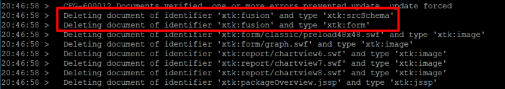

# Obtendo XML-110011 Não é possível localizar o elemento &#39;element&#39; com o atributo &#39;name&#39; definido como &#39;fusion&#39; (documento com esquema)

## Descrição

<b>Para usuários no local</b>     Depois de atualizar uma instância do Campaign para ACC-21.1 build 9342 ou superior, quando tento instalar qualquer pacote do Campaign, recebo o seguinte erro:     

## Resolução

O esquema de fusão (xtk:fusion) deve ser eliminado no processo pós-atualização. Mas em alguns casos, o schema ainda está presente.

Ao consultar o banco de dados da seguinte maneira, você poderá ver os seguintes registros:

Para remover o schema xtk:fusion, é necessário executar a ferramenta postupgrade com a opção &quot;-force&quot;:

`nlserver config -postupgrade -allinstances -force`

Você deve ver o seguinte:

Se o schema ainda estiver presente, tente com as opções &quot;-force -repair&quot;:

`nlserver config -postupgrade -allinstances -force -repair`

Se ainda não funcionar, talvez seja necessário remover manualmente os registros do banco de dados.
