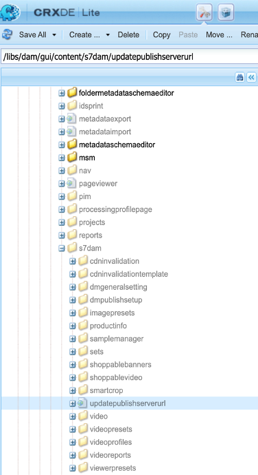

# Alteração do URL do Dynamic Media para ativos DM

O artigo explica como alterar o URL do Dynamic Media para ativos DM.

## Descrição {#description}

### Ambiente

- Experience Manager Assets
- Experience Manager 6.5

### Problema/Sintomas

Na instância do autor do Adobe Experience Manager (AEM) (versão 6.5.11 e superior), é possível usar a seção Configurações gerais para definir as configurações do Servidor DM e alterar o URL do servidor de publicação ou o URL do Dynamic Media para seus ativos DM.

Para abrir a página Configurações gerais do Dynamic Media, na instância do autor AEM, clique em <b>Ferramentas</b>, em seguida, vá para <b>Assets</b>, em seguida, vá para <b>Configuração geral do Dynamic Media</b>.

Verifique se você configurou o Dynamic Media na instância do autor AEM. Clique em <b>Ferramentas</b>, em seguida, vá para<b> Cloud Service</b> em seguida, vá para <b>Configuração do Dynamic Media</b>.

O Nome do servidor publicado é o servidor da Rede de entrega de conteúdo (CDN) usado em todas as chamadas de URL geradas pelo sistema específicas para sua conta da Dynamic Media.

Certifique-se de que o nome de domínio personalizado esteja mapeado para o servidor da rede de distribuição de conteúdo (CDN) do Adobe ou, caso esteja usando o nome de domínio do seu próprio provedor de CDN, ele deverá ser mapeado para o nosso servidor de origem\*

\*Entre em contato com o Suporte da Adobe Dynamic Media para obter mais informações.

## Resolução {#resolution}

Depois de alterar o Nome do servidor publicado, salve as alterações. Não alterar <b>Nome do servidor de origem</b> a menos que seja instruído a fazê-lo por um técnico de suporte do Adobe Dynamic Media.

Instruções para alterar o Nome do servidor publicado para componentes existentes do Dynamic Media nas páginas do Sites:

- Instale o pacote anexado para criar o nó Publicar URLs do servidor
- Depois que o pacote for instalado, você observará que 2 arquivos foram criados no AEM Author

   - [/libs/dam/gui/content/s7dam/updatepublishserverurl](http://vgaur-wx-1:4502/crx/de/index.jsp#/crx.default/jcr%3aroot/libs/dam/gui/content/s7dam/updatepublishserverurl "Caminho da exibição no CRXDE Lite")
   - [/libs/dam/gui/components/s7dam/updatepublishserverurl/updatepublishserverurl.js](http://vgaur-wx-1:4502/crx/de/index.jsp#/crx.default/jcr%3aroot/libs/dam/gui/components/s7dam/updatepublishserverurl/updatepublishserverurl.jsp "Caminho da exibição no CRXDE Lite")p

.         

- &#x200B;&#x200B;&#x200B; &#x200B; &#x200B; &#x200B; &#x200B;no caminho do AEM SitesDigite o caminho &quot;Digite o caminho do seu neste URL: http://`<` aem-server`>` :portnumber/libs/dam/gui/content/s7dam/updatepublishserverurl.html?path=/content/mysite&#x200B; &#x200B; &#x200B; &#x200B; &#x200B;true&#x200B; &#x200B;
- Fornecer esse URL atualizará automaticamente os URLs DM para todos os componentes do Dynamic Media em todas as páginas do Sites no caminho do AEM Sites mencionado e mostrará esse tipo de saída

Todos os URLs de componentes do Dynamic Media serão alterados para o novo Nome do servidor publicado para seu site AEM.
Essa é uma exibição do componente DM, usando o antigo Nome do servidor publicado

Esta é uma exibição do Componente DM, nome do Servidor publicado alterado após acessar este URL: http://`<` aem-server`>` :portnumber/libs/dam/gui/content/s7dam/updatepublishserverurl.html?path=/content/mysite&amp;update=true

Observação: para obter uma lista de todos os componentes do Dynamic Media no caminho do AEM Sites, você pode chamar este URL: <u style="text-decoration:underline">http://`<` aem-server`>` :portnumber/libs/dam/gui/content/s7dam/updatepublishserverurl.html?path=/content/mysite</u>

&#x200B;&#x200B;&#x200B; &#x200B; &#x200B; &#x200B; &#x200B;
