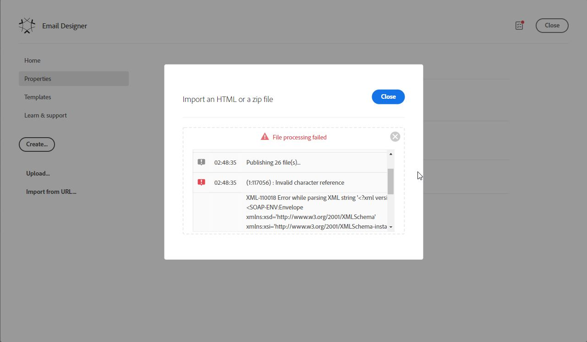

# Erro durante a importação do HTML para o Email Designer

## Descrição {#description}

<b>Ambiente</b>
Campaign Standard


<b>Problema/Sintomas</b>
Durante uma importação de um arquivo .zip com um arquivo HTML e imagens para o Email Designer, o seguinte erro foi encontrado:


```
(1:117056) : Invalid character reference

XML-110018 Error while parsing XML string '`<` ?xml version='1.0'?`>` `<` SOAP-ENV:Envelope 
xmlns:xsd='http://www.w3.org/2001/XMLSchema' 
xmlns:xsi='http://www.w3.org/2001/XMLSchema-instance' 
xmlns:ns='urn:nms:contentModel' 
xmlns:SOAP-ENV='http://schemas.xmlsoap.org/soap/envelope/'`>` `<` SOAP-ENV:Body`>` `<` ExtractAndPatchContentResponse 
xmlns='urn:nms:contentModel' SOAP-ENV:encodingStyle='http://schemas.xmlsoap.org/soap/encoding/'`>` `<` pstrContent xsi:type='xsd:string'`>` &lt;html xmlns=&quot;http://www.w3.org/1999/xhtml&quot;&#10; 
xmlns:v=&quot;urn:schemas-microsoft-com:vm'
```





## Resolução {#resolution}


<b>Motivo:</b>

O arquivo HTML continha o caractere ASCII 0x03. Depois que o caractere foi removido do arquivo HTML, a importação funcionou.
