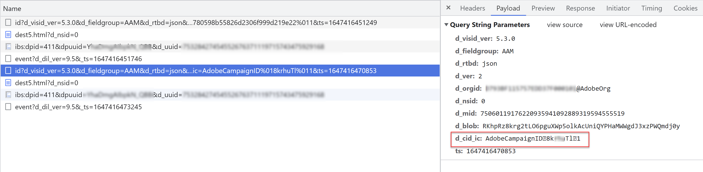

# Públicos-alvo e segmentos Experience Cloud/Biblioteca de público-alvo/AAM não têm volume ou tamanho no Adobe Campaign

## Descrição {#description}

QUESTÃO/SINTOMA:
<br>Embora tudo pareça estar configurado corretamente, os públicos-alvo e segmentos da Experience Cloud/Biblioteca de público-alvo/AAM não têm volume nem tamanho no Adobe Campaign
<br> 
<br>CONFIGURAÇÃO DO AMBIENTE:<br>
- Campaign Classic ou Standard
- AAM e/ou biblioteca de público-alvo
- Campanha configurada com sucesso [Padrão](https://experienceleague.adobe.com/docs/campaign-standard/using/integrating-with-adobe-cloud/working-with-campaign-and-audience-manager-or-people-core-service/provisioning-and-configuring-integration-with-audience-manager-or-people-core-service.html?lang=en) ou [Classic](https://experienceleague.adobe.com/docs/campaign-classic/using/integrating-with-adobe-experience-cloud/audience-sharing/configuring-shared-audiences-integration-in-adobe-campaign.html?lang=en) para usar o Experience Cloud Audiences (Serviço principal de pessoas, Biblioteca de público-alvo ou AAM)
- If Campaign Classic: Os usuários podem fazer logon no Campaign Classic por meio de IMS do Adobe
- O segmento AAM ou o público-alvo da biblioteca de público-alvo foi configurado para enviar ao Campaign usando a fonte de dados ID declarada na interface do Campaign.


## Resolução {#resolution}


CAUSAS PRINCIPAIS: como uma das principais finalidades do Campaign é enviar mensagens (email, SMS etc.) Para indivíduos conhecidos, o AAM (Biblioteca de público-alvo) precisa ter a mesma ID que o Campaign usa para a identificação do cliente armazenada em sua própria fonte de dados de ID declarada (AAM). Para essa integração, o AAM (Audience Library, Biblioteca de público-alvo) está simplesmente enviando a lista de IDs do cliente para esses clientes no segmento/público escolhido para o Campaign, para que o Campaign possa identificar e criar uma lista das mesmas pessoas. Se o AAM não tiver as IDs para enviar, nenhum público-alvo será enviado do AAM (Biblioteca de público-alvo) para o Campaign. 
 
ETAPAS PARA RESOLVER: Siga as seguintes etapas para armazenar a ID do cliente necessária na fonte de dados da ID declarada do AAM:

1. Verifique se a ID do cliente necessária pode ser exibida na página quando o usuário final se autenticar.
2. Quando o usuário final for autenticado, sincronize o identificador do cliente com a fonte de dados da ID declarada do AAM por meio da [função setCustomerID do serviço de Experience Cloud ID](https://experienceleague.adobe.com/docs/id-service/using/id-service-api/methods/setcustomerids.html?lang=en) (ou use o Serviço de ID de Experience Cloud - ação Definir ID do cliente na Coleção de dados) usando o código/alias de integração: AdobeCampaignID. Por exemplo:


```
Visitor.setCustomerIDs({
         "AdobeCampaignID":{ 
             "id":"YOUR CUSTOMER ID", 
             "authState":Visitor.AuthState.AUTHENTICATED 
        } 
 });
```


ou em Coleção de dados:

 
Onde %custID% representa um elemento de dados em que a ID do cliente necessária é armazenada

1. Valide se a ID é enviada para AAM procurando pelo parâmetro d_cid_ic da chamada de rede demdex.net enviada quando a função setCustomerID é chamada. Você deve ver o código de integração do Adobe Campaign ID, a ID do cliente e o valor de 1 (que significa autenticado) separados por um caractere não imprimível.




1. Aguarde alguns dias para que as IDs do cliente sejam coletadas no AAM e monitore o tamanho do público no Campaign.

