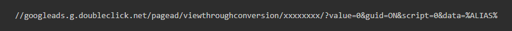
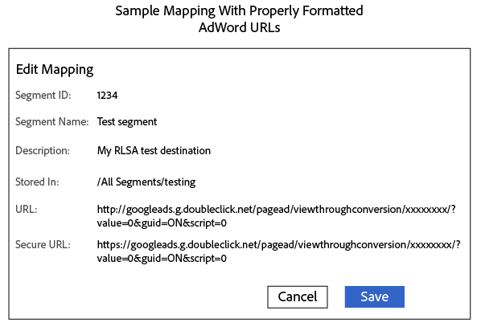

# Destino do Google - AAM

Saiba como configurar o Destino do URL em detalhes neste artigo.

## Descrição {#description}

### Ambiente

Audience Manager

### Problema/Sintomas

Este artigo fornece um detalhe sobre quatro queries principais.

1. Quantos tipos de integração o Google tem.
2. Como configurar o destino S2S (destinos de servidor para servidor).
3. RLSA (Listas de remarketing para anúncios de pesquisa).
4. Pontos principais.

## Resolução {#resolution}

<b>Tipos de destinos</b>

Destino S2S

Destino do URL

<b>Destino do URL - Lista de remarketing de anúncios do Google</b>

Estas são algumas etapas que precisam ser seguidas para configurar o Destino do URL.

- Na sua conta do Google Ads, [criar uma lista de remarketing do site](https://support.google.com/google-ads/answer/2454064?hl=en) e anote o ID de conversão.
- Use o seguinte URL como modelo para o URL básico e o URL seguro. Substitua a seção &quot;xxxxxxxx&quot; pelo seu ID de conversão.

- No AAM, crie um destino de URL - Siga este link ([Criar um destino de URL](https://experienceleague.adobe.com/en/docs/audience-manager/user-guide/features/destinations/custom-destinations/create-url-destination)).
- Na seção Mapeamentos de segmentos do destino do URL, adicione o código da etapa 2 aos campos URL e URL seguro. Coloque o prefixo http: and https: in nos campos URL e Secure URL, respectivamente.

Observe que há dois tipos de URLs

- URL base OU código de URL não seguro - Inicia com HTTP

- Código de URL seguro - Iniciar com HTTPS

- Clique em Salvar.
- Ao mapear um novo segmento para esse destino no Audience Manager, defina o mapeamento como <b>aam=segmentID </b>e substituir <b>segmentID </b>com a ID do respectivo segmento.
- Ao definir um bucket no Google Ads, crie uma regra que corresponda ao mapeamento definido na etapa 6.

<b>Destino S2S:</b>

1. Para começar com a criação do Destino S2S para Google, CC ou Consultor será transmitido com o tipo de conta. O tipo de conta pode ser dos seguintes tipos: INVITE_ADVERTISER , INVITE_PARTNER, DFP, ADX, ADX_PUBLISHER , DFP_BY_GOOGLE, DFP_BY_GOOGLE. Observe também que esse tipo deve ser incluído na lista de permissões no final do Google. (O usuário pode consultar a equipe da Google sobre esta parte).
2. Quando estiver disponível em detalhes, CC ou o Consultor poderá criar o destino.

<b>Pontos principais: </b>

- A configuração de destino do Google S2S oferecerá suporte à transferência de dados para todos os 6 tipos de dispositivo a seguir:  <b>cookie da Web/iOS-mobile/android-mobile/Roku/Microsoft/Amazon Fire TV</b>.
- Para criar o URL da Lista de comentários do Google Ads, certifique-se de usar <b>&quot;%ALIAS%&quot;</b> em ambos os tipos de URLs. Como esta é uma macro que será substituída em tempo de execução.
- Se algum erro ocorrer ao criar o Destino S2S para o Google, verifique os pontos abaixo.

1. A conta deve ser incluída na lista de permissões no final do Google.
2. Use os detalhes corretos, como protocolo, servidores, formato, fonte de dados do Target etc. Consulte o link no segmento S2S.

