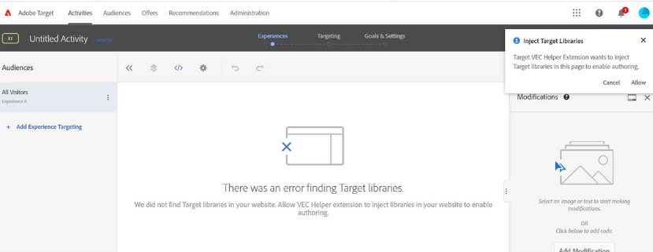

# Depuração/solução de problemas do VEC do Target

## Descrição

Não é possível carregar o URL da página no VEC do Adobe Target.

Estes são alguns exemplos de erros:

- 
- 
- 

## Resolução

1. Tente limpar cookies e caches ou abrir seu site no modo incógnito. 

1. Tente usar um navegador alternativo, como - [!DNL Mozilla Firefox], [!DNL Microsoft Edge]

1. Nesses casos de erro, instale a extensão de navegador VEC Helper

   1. Instale a extensão de [https://chrome.google.com/webstore/detail/adobe-target-vec-helper/ggjpideecfnbipkacplkhhaflkdjagak](https://chrome.google.com/webstore/detail/adobe-target-vec-helper/ggjpideecfnbipkacplkhhaflkdjagak)

   1. Para usar a extensão, clique no ícone da extensão do navegador VEC Helper em seu [!DNL Chrome] barra de ferramentas do navegador enquanto estiver no VEC. 

   1. Ative o &quot;**injetar bibliotecas do target**&quot; e &quot;cookies&quot; alternam &quot;ativado&quot;.

      

   1. Pop-up solicitando que você permita a extensão para adicionar bibliotecas de direcionamento à página para ativar a criação, que você precisa permitir.

   1. Permitir o conteúdo inseguro das configurações do site ([https://experienceleague.adobe.com/docs/target/using/experiences/vec/troubleshoot-composer/mixed-content.html?lang=en](https://experienceleague.adobe.com/docs/target/using/experiences/vec/troubleshoot-composer/mixed-content.html?lang=en))

      - Clique no ícone de bloqueio (cuidado) e, em seguida, clique nas configurações do site.

      - Role para conteúdo inseguro e use a lista suspensa para alterar &quot;Bloquear (padrão)&quot; para &quot;Permitir&quot;.

      - Recarregue a página do VEC.
   1. Defina o EEC (Enhanced experience composer) como desativado pelas seguintes etapas

      - Ir para [!DNL Target] - [!UICONTROL Administração] - VEC - Desligar o EEC

         
   Observação: Caso o problema persista, abra o console do desenvolvedor do navegador e procure por uma mensagem de erro lá.

1. O destino não é suportado se o site contiver iframes de vários níveis. 

**Como acessar páginas pós-login no VEC**

1. Carregue a página no VEC, clique na &quot;guia do navegador&quot;, insira suas credenciais e vá para a página desejada. 
1. Clique em [!UICONTROL Compor] e faça a modificação no VEC. 

OR

1. Abra um site em uma nova guia e insira suas credenciais de logon.
1. Abra o VEC em [!DNL Target] e carregue diretamente a página após fazer logon. 
1. Agora, a página será carregada no VEC para fazer a modificação.
