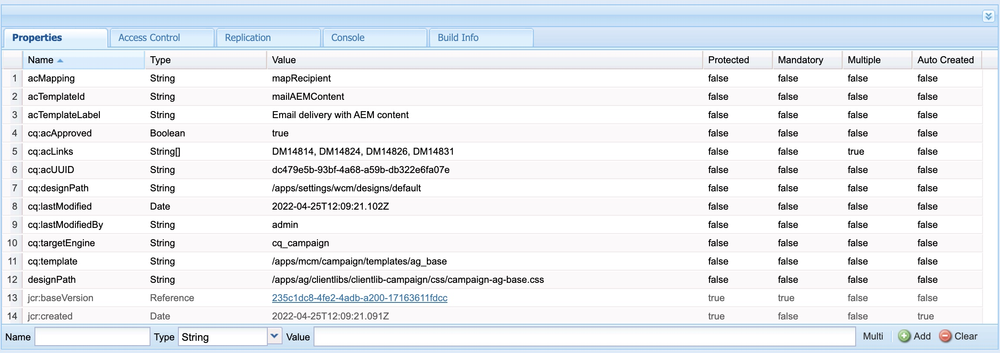

# AEM Modelos de email não são sincronizados com o Adobe Campaign.

## Descrição {#description}

<b>Ambiente</b>

- Adobe Experience Manager

<b>Problema/Sintomas</b>

Quando um usuário tenta copiar e colar o modelo do site no qual o fluxo de trabalho de aprovação da campanha já está executado, as propriedades cq:acLinks e cq:acUUID para Adobe Campaign não são removidas.

Devido a isso, a campanha do Adobe não é capaz de sincronizar o modelo de Email do AEM e gera um erro: O acUUID duplicado encontrado como as propriedades cq:acLinks e cq:acUUID são propriedades exclusivas.

<b>Etapas para reproduzir:</b>

1: Crie um modelo de email do site no AEM.
2: Execute o fluxo de trabalho Campaign Approval .
3: Aprove o template completando as etapas do fluxo de trabalho.
4: Navegue até crx/de.
5: O modelo copiar/colar conterá as propriedades cq:acLinks e cq:acUUID.

<b>Erros nos registros:</b>

Nenhum erro relacionado pode ser encontrado nos logs de erro.

<b>Propriedades de Modelo no crx/de após a operação Copiar-colar:</b>

<b>Experienciado </b><b>Comportamento:</b>

<b>Esperado </b><b>Comportamento</b><b>:</b>

## Resolução {#resolution}

O campaign-property-modification-service é um usuário de serviço usado para modificar propriedades do informativo do campaign na função de copiar e colar.
Este serviço usercampaign-property-modification-deve ter permissões de leitura e modificação na pasta de conteúdo.

Se não tiver permissões de leitura e modificação na pasta de conteúdo, ela não poderá limpar as propriedades cq:acLinks e cq:acUUID do modelo de site copiado colado.

Após fornecer as permissões necessárias ao usuário, as propriedades são limpas.

<b>Captura de tela das Permissões do usuário:</b>

