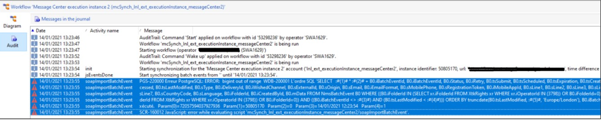

# Campaign Classic: PGS-220000 PostgreSQL: ERRO: bigint fora do intervalo

## Descrição {#description}

<b>Ambiente</b>
Adobe Campaign Classic v7

<b>Problema</b>
Você recebe o seguinte erro ao executar o workflow de arquivamento (mcSynch) do Centro de Mensagens:

## Resolução {#resolution}

<b>Solução</b>
O problema é a ID da instância de execução que foi usada para identificar a instância de execução de RT.

Como mostrado acima, o valor usado é *50 805 170*.

A ID da instância de execução é usada pelo workflow de arquivamento da seguinte maneira:

vars.CELL_OFFSET + &quot;\*&quot; + vars.cellId + &quot; + @id&quot;

Em que 

- CELL_OFFSET é uma constante (72057594037927936) criada pela atividade &quot;Connection information&quot;.

- cellId é a ID da instância de execução.

Esses dois números acima são multiplicados juntos. O número do resultado final é maior que o valor máximo do tipo bigint Postgres ([Tipos Numéricos PostgreSQL](https://www.postgresql.org/docs/10/datatype-numeric.html)).

Os dois valores são adicionados à query da seguinte maneira:

SELECIONAR   <b>:#(1)# \* :#(2)# + B0.iBatchEventId</b>, B0.iBatchEventId, B0.iStatus, B0.iRetry, B0.tsSubmit, B0.tsScheduled, B0.tsExpiration, B0.tsCreated, B0.tsProcessing, B0.tsProcessed, B0.tsLastModified, B0.sType, B0.iDelivery Id, B0.iWishedChannel, B0.sExternalId, B0.sOrigin, B0.sEmail, B0.iEmailFormat, B0.sMobilePhone, B0.sRegistrationToken, B0.iMobileAppId, B0.sLine1, B0.sLine2, B0.s Linha3, B0.sLine4, B0.sLine5, B0.sLine6, B0.sLine7, B0.sCountryCode, B0.sLanguage, B0.iFolderId, B0.iCreatedById, B0.mData DE NmsBatchEvent B0 WHERE ((B0.iFolder) derId IN (SELECIONE xr.iFolderId FROM XtkRights xr WHERE xr.iOperatorId IN (3798) OU B0.iFolderId=0)) E ((B0.iFolderId IN (SELECIONE xr.iFolderId DE XtkRights xr ONDE r.iOperatorId IN (3798) OR B0.iFolderId=0)) E ((B0.iBatchEventId :#(3)#) E (B0.tsLastModified :#(4)#)) ORDEM POR truncdate(B0.tsLastModified, :#(5)#, &#39;Europe /Londres&#39;), B0.iBatchEventId LIMIT 501&#39; Param(0)=72057594037927936\n — :#(1)#

Param(1)=50805170\n — :#(2)#

Param(2)=0\n Param(3)=09/04/2021 05:00:26\n Param(4)=1

A solução é utilizar um número menor como a ID da instância de execução.
