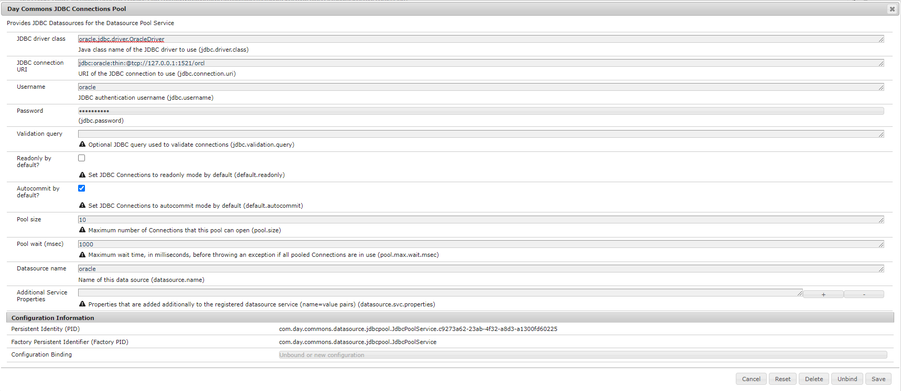

# [!DNL Oracle] Conexão de banco de dados do AEM as a cloud service

## Descrição


As etapas abaixo contêm os [!DNL maven] dependência, serviço OSGi e configurações necessárias para conectar o [!DNL Oracle] banco de dados do AEM as a cloud service.


## Resolução


Para conectar o banco de dados do oracle a partir do AEM as a cloud service, siga as 3 abaixo.

- <u><b>Adição de [!DNL Maven] dependência em pom</b></u>
- <u><b>Serviço AEM para conexão com [!DNL Oracle] banco de dados</b></u>
- <u><b>Configuração do OSGi</b></u>


<u><b>Adição de [!DNL Maven] dependência em pom</b></u>

<b>Etapa 1:</b> Inclua o abaixo [!DNL maven] dependência no principal de seus projetos `pom.xml`

```
dependency
                groupIdcom.oracle.database.jdbc/groupId
                artifactIdojdbc-bom/artifactId
                version21.5.0.0/version
                typepom/type
                scopeimport/scope
            /dependency
```

<b>Etapa 2 : </b>Inclua o abaixo [!DNL maven] dependência em `pom.xml` de &quot;núcleo&quot; e &quot;tudo&quot;.

```
dependency
            groupIdcom.oracle.database.jdbc/groupId
            artifactIdojdbc8/artifactId
        /dependency
        dependency
            groupIdcom.oracle.database.jdbc/groupId
            artifactIducp/artifactId
        /dependency
        dependency
            groupIdcom.oracle.database.xml/groupId
            artifactIdxdb/artifactId
        /dependency
```

<u><b>Serviço AEM para conexão com [!DNL Oracle] banco de dados</b></u>

Exemplo de código de serviço para conexão com o banco de dados do AEM as a cloud service, ele pode ser incluído no caminho 0

0 pasta do projeto - núcleo - serviço

```
DatabaseService.java
package com.mysite.core.services; 
public interface DatabaseService {}
DatabaseServiceImpl.java
package com.mysite.core.services; 
import com.day.commons.datasource.poolservice.DataSourcePool;
import org.osgi.service.component.annotations.Activate;
import org.osgi.service.component.annotations.Component;
import org.osgi.service.component.annotations.Reference;
import org.slf4j.Logger;
import org.slf4j.LoggerFactory; 
import javax.sql.DataSource;
import java.sql.Connection; 
@Component(  service = DatabaseService.class,   immediate = true) public class DatabaseServiceImpl implements DatabaseService {   
    private final Logger LOGGER = LoggerFactory.getLogger(DatabaseService.class);   
    @Reference   private DataSourcePool dataSourcePool;   
    @Activate   public void activate() {     
        try {      
            DataSource dataSource = (DataSource) dataSourcePool.getDataSource("oracle");      
            Connection connection = dataSource.getConnection();       
            if (connection != null) {        
                if (!connection.isClosed()) {          
                    LOGGER.info("Connected with connection #4");          
                    connection.close();        
                }      
            }      
            else {        
                LOGGER.info("Connection is null");      
            }    
        } catch (Exception ex) {      
            LOGGER.error("It was not possible to get the data source: " + ex.getMessage(), ex);    
        }  
    }
}
```

<u><b>Configuração do OSGi</b></u>

<b> Etapa 1: </b>Vá para AEM OSGI configuration2 no local

<b>Etapa 2: </b>Procure por &quot;JDBC Connection pool&quot; e configure os valores abaixo em relação ao seu banco de dados (consulte captura de tela para obter valores de exemplo)

- Classe de driver JDBC
- URL de conexão JDBC
- Nome de usuário e senha
- Nome da fonte de dados




<b>Etapa 3: </b>Siga as etapas em 3 e converta a configuração do osgi em arquivo &quot;.cfg.json&quot; e adicione o mesmo na configuração do projeto de acordo com o AEMaaCS Standard.

2 http://localhost:4502/system/console/configMgr

3 [https://experienceleague.adobe.com/docs/experience-manager-cloud-service/content/implementing/deploying/configuring-osgi.html?lang=en#generating-osgi-configurations-using-the-aem-sdk-quickstart](https://experienceleague.adobe.com/docs/experience-manager-cloud-service/content/implementing/deploying/configuring-osgi.html?lang=en#generating-osgi-configurations-using-the-aem-sdk-quickstart)
