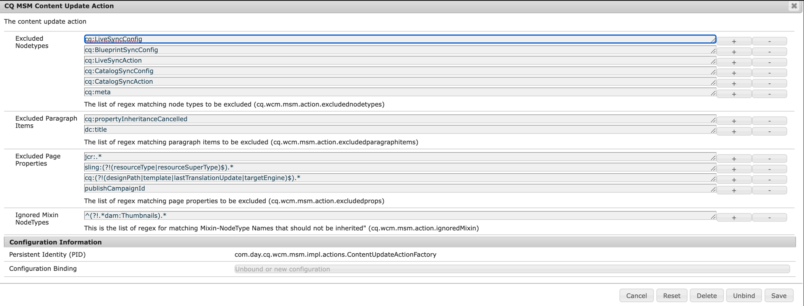

# Falha na implantação devido à combinação conflitante (e ao usar a interface clássica)

## Descrição


A implementação de uma página está falhando devido a alguns conflitos *`jcr:mixinTypes`* no nó de miniatura da página.

O conflito ocorre quando a página foi configurada com uma miniatura <b>usando a interface clássica</b> e, em seguida, implantadas inicialmente (primeira implantação).

Neste ponto, a execução da página principal está falhando devido à combinação conflitante na estrutura de miniatura da página, entre:

- `dam:Thumbnails`
- `cq:LiveRelationship`


O erro fornecido no log é o seguinte:


```
27.07.2022 15:48:07.091 *ERROR* 0:0:0:0:0:0:0:1 1658929687039 POST /bin/wcmcommand HTTP/1.1 com.day.cq.wcm.msm.impl.commands.RolloutCommand Error during roll-out.
com.day.cq.wcm.api.WCMException: com.day.cq.wcm.api.WCMException: com.day.cq.wcm.api.WCMException: com.day.cq.wcm.api.WCMException: com.day.cq.wcm.api.WCMException: com.day.cq.wcm.api.WCMException: javax.jcr.nodetype.ConstraintViolationException: No matching node definition found for dam:thumbnails
    at com.day.cq.wcm.msm.impl.RolloutManagerImpl.rolloutResource(RolloutManagerImpl.java:824) com.day.cq.wcm.cq-msm-core:5.11.84
    at com.day.cq.wcm.msm.impl.RolloutManagerImpl.rolloutPage(RolloutManagerImpl.java:693) com.day.cq.wcm.cq-msm-core:5.11.84
    at com.day.cq.wcm.msm.impl.RolloutManagerImpl.rolloutPageRelations(RolloutManagerImpl.java:624) com.day.cq.wcm.cq-msm-core:5.11.84
    at com.day.cq.wcm.msm.impl.RolloutManagerImpl.rollout(RolloutManagerImpl.java:515) com.day.cq.wcm.cq-msm-core:5.11.84
    at com.day.cq.wcm.msm.impl.commands.RolloutCommand.performCommand(RolloutCommand.java:153) com.day.cq.wcm.cq-msm-core:5.11.84
    at com.day.cq.wcm.core.impl.commands.WCMCommandService$CommandHolder.performCommand(WCMCommandService.java:178) com.day.cq.wcm.cq-wcm-core:5.11.312
    at com.day.cq.wcm.core.impl.commands.WCMCommandServlet.performCommand(WCMCommandServlet.java:120) com.day.cq.wcm.cq-wcm-core:5.11.312
    at com.day.cq.commons.servlets.AbstractCommandServlet.doPost(AbstractCommandServlet.java:49) com.day.cq.cq-commons:5.11.18
    at org.apache.sling.api.servlets.SlingAllMethodsServlet.mayService(SlingAllMethodsServlet.java:146) org.apache.sling.api:2.20.0
    at org.apache.sling.api.servlets.SlingSafeMethodsServlet.service(SlingSafeMethodsServlet.java:342) org.apache.sling.api:2.20.0
    ..
Caused by: com.day.cq.wcm.api.WCMException: com.day.cq.wcm.api.WCMException: com.day.cq.wcm.api.WCMException: com.day.cq.wcm.api.WCMException: com.day.cq.wcm.api.WCMException: javax.jcr.nodetype.ConstraintViolationException: No matching node definition found for dam:thumbnails
    at com.day.cq.wcm.msm.impl.RolloutManagerImpl.rolloutResource(RolloutManagerImpl.java:824) com.day.cq.wcm.cq-msm-core:5.11.84
    at com.day.cq.wcm.msm.impl.RolloutManagerImpl.rolloutResource(RolloutManagerImpl.java:811) com.day.cq.wcm.cq-msm-core:5.11.84
    ... 135 common frames omitted
Caused by: com.day.cq.wcm.api.WCMException: com.day.cq.wcm.api.WCMException: com.day.cq.wcm.api.WCMException: com.day.cq.wcm.api.WCMException: javax.jcr.nodetype.ConstraintViolationException: No matching node definition found for dam:thumbnails
    at com.day.cq.wcm.msm.impl.RolloutManagerImpl.rolloutResource(RolloutManagerImpl.java:824) com.day.cq.wcm.cq-msm-core:5.11.84
    at com.day.cq.wcm.msm.impl.RolloutManagerImpl.rolloutResource(RolloutManagerImpl.java:811) com.day.cq.wcm.cq-msm-core:5.11.84
    ... 136 common frames omitted
Caused by: com.day.cq.wcm.api.WCMException: com.day.cq.wcm.api.WCMException: com.day.cq.wcm.api.WCMException: javax.jcr.nodetype.ConstraintViolationException: No matching node definition found for dam:thumbnails
    at com.day.cq.wcm.msm.impl.RolloutManagerImpl.rolloutResource(RolloutManagerImpl.java:824) com.day.cq.wcm.cq-msm-core:5.11.84
    at com.day.cq.wcm.msm.impl.RolloutManagerImpl.rolloutResource(RolloutManagerImpl.java:811) com.day.cq.wcm.cq-msm-core:5.11.84
    ... 137 common frames omitted
Caused by: com.day.cq.wcm.api.WCMException: com.day.cq.wcm.api.WCMException: javax.jcr.nodetype.ConstraintViolationException: No matching node definition found for dam:thumbnails
    at com.day.cq.wcm.msm.impl.RolloutManagerImpl.rolloutResource(RolloutManagerImpl.java:824) com.day.cq.wcm.cq-msm-core:5.11.84
    at com.day.cq.wcm.msm.impl.RolloutManagerImpl.rolloutResource(RolloutManagerImpl.java:811) com.day.cq.wcm.cq-msm-core:5.11.84
    ... 138 common frames omitted
Caused by: com.day.cq.wcm.api.WCMException: javax.jcr.nodetype.ConstraintViolationException: No matching node definition found for dam:thumbnails
    at com.day.cq.wcm.msm.commons.BaseAction.execute(BaseAction.java:154) com.day.cq.wcm.cq-msm-commons:1.1.2
    at com.day.cq.wcm.msm.impl.RolloutManagerImpl.rolloutResource(RolloutManagerImpl.java:790) com.day.cq.wcm.cq-msm-core:5.11.84
    ... 139 common frames omitted
Caused by: javax.jcr.nodetype.ConstraintViolationException: No matching node definition found for dam:thumbnails
    at org.apache.jackrabbit.oak.plugins.nodetype.EffectiveNodeTypeImpl.getNodeDefinition(EffectiveNodeTypeImpl.java:454) org.apache.jackrabbit.oak-core:1.8.22
    at org.apache.jackrabbit.oak.plugins.nodetype.ReadOnlyNodeTypeManager.getDefinition(ReadOnlyNodeTypeManager.java:396) org.apache.jackrabbit.oak-core:1.8.22
    at org.apache.jackrabbit.oak.jcr.session.NodeImpl$29.perform(NodeImpl.java:1031) org.apache.jackrabbit.oak-jcr:1.8.22
    at org.apache.jackrabbit.oak.jcr.session.NodeImpl$29.perform(NodeImpl.java:1023) org.apache.jackrabbit.oak-jcr:1.8.22
    at org.apache.jackrabbit.oak.jcr.delegate.SessionDelegate.perform(SessionDelegate.java:207) org.apache.jackrabbit.oak-jcr:1.8.22
    at org.apache.jackrabbit.oak.jcr.session.ItemImpl.perform(ItemImpl.java:112) org.apache.jackrabbit.oak-jcr:1.8.22
    at org.apache.jackrabbit.oak.jcr.session.NodeImpl.getDefinition(NodeImpl.java:1023) org.apache.jackrabbit.oak-jcr:1.8.22
    at com.day.cq.wcm.msm.commons.ItemFilterImpl.excludes(ItemFilterImpl.java:91) com.day.cq.wcm.cq-msm-commons:1.1.2
    at com.day.cq.wcm.msm.impl.actions.ContentCopyActionFactory$ContentCopyAction.applyFilters(ContentCopyActionFactory.java:293) com.day.cq.wcm.cq-msm-core:5.11.84
    at com.day.cq.wcm.msm.impl.actions.ContentCopyActionFactory$ContentCopyAction.createCopy(ContentCopyActionFactory.java:245) com.day.cq.wcm.cq-msm-core:5.11.84
    at com.day.cq.wcm.msm.impl.actions.ContentCopyActionFactory$ContentCopyAction.doExecute(ContentCopyActionFactory.java:208) com.day.cq.wcm.cq-msm-core:5.11.84
    at com.day.cq.wcm.msm.commons.BaseAction.execute(BaseAction.java:134) com.day.cq.wcm.cq-msm-commons:1.1.2
    ... 140 common frames omitted
```


<b>Etapas a serem reproduzidas:</b>

1. iniciar um AEM baunilha 6.5.13.0
2. ir para <b>`/siteadmin`</b> (para usar <b>Interface clássica</b>)
3. abra as propriedades da página de `/content/we-retail/language-master/en/women`
4. na imagem *guia* definir qualquer imagem como miniatura
5. implantar a página
6. agora vá para <b>[!DNL Sites] interface</b>
7. abra as propriedades da página para `/content/we-retail/us/en/women` again
8. no *[!UICONTROL Miniatura]* clique em *[!UICONTROL Gerar visualização]* e salvar a alteração
9. agora é implantado novamente na página em `/siteadmin`


## Resolução


Esse problema ocorre durante a implantação porque o AEM não pode criar `dam:thumbnails` nó abaixo `jcr:content` para página de Live Copy (`/content/we-retail/us/en/women/jcr:content/image/file/jcr:content`) e o motivo para isso é durante a implantação do mixinType `dam:Thumbnails` não é aplicado ao nó da página de Live Copy `/content/we-retail/us/en/women/jcr:content/image/file/jcr:content` e `dam:Thumbnails` só pode ser criada abaixo `dam:Thumbnails` nodeType.

O comportamento Padrão do MSM é ignorar o novo mixin adicionado aos nós na origem durante a implantação 0 e, portanto, não é adicionado a `/content/we-retail/us/en/women/jcr:content/image/file/jcr:content`.

Para corrigir esse problema, esse comportamento pode ser alterado por meio da configuração da ação de atualização de conteúdo.
Por padrão, cada Tipo de mixin está sendo ignorado, como mostrado na captura de tela abaixo:


Ele deve ser atualizado para usar:


```
(?!.*dam:Thumbnails).*
```


conforme mostrado na captura de tela abaixo:



Isso deve corrigir o problema.

0 https://experienceleague.adobe.com/docs/experience-manager-64/administering/introduction/msm-sync.html?lang=en#excluding-properties-and-node-types-from-synchronization
