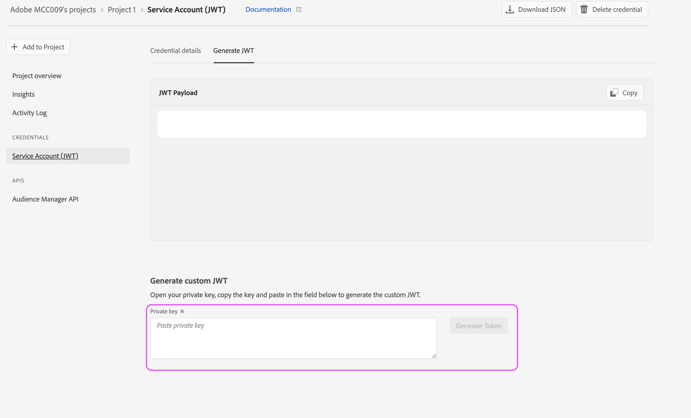

# Como configurar o acesso à API do AAM

## Descrição

Este artigo descreve como criar um projeto no console do desenvolvedor para gerar credenciais JWT da API do Audience Manager.

## Resolução

Você precisará de permissões de administrador do sistema no Admin Console para gerar credenciais para a API Audience Manager. As etapas 1 e 2 descrevem como conceder essas permissões escaladas. Os administradores atuais do sistema podem preferir seguir essas etapas a si mesmos, em vez de conceder permissões de administrador escalonadas a um usuário adicional, nesse caso, pule diretamente para a etapa 3.

1. Navegue até a [Admin Console](https://adminconsole.adobe.com/) e selecione [!UICONTROL Adicionar administradores] do [!UICONTROL Links rápidos] menu:

   

1. Insira os emails de todos os usuários aos quais você deseja conceder acesso. Na próxima página, selecione &quot;[!UICONTROL Administrador do sistema]&quot; para o nível de permissão:

   

1. Navegue até [https://developer.adobe.com/console](https://developer.adobe.com/console) . Se você ainda não tiver acesso, apesar de ter recebido direitos de administrador do sistema nas etapas anteriores, tente atualizar seus cookies/cache.

1. Crie um novo projeto na [!UICONTROL Início rápido] (ou o menu [!UICONTROL Projetos] no início da navegação):

   

1. Adicione a API Audience Manager ao projeto:

   

   

1. Siga as etapas para gerar (ou fazer upload) suas credenciais JWT. Se optar por gerar as credenciais por meio do console dev, armazene com segurança a chave privada. Você precisará da sua chave privada em etapas posteriores. 

   

1. Em seguida, você será solicitado a atribuir as credenciais aos perfis de produto relevantes. Se sua organização utilizar controles de acesso com base em funções, será necessário seguir estas etapas para criar uma conta de usuário técnico e adicionar essa conta ao grupo RBAC relevante: [https://experienceleague.adobe.com/docs/audience-manager/user-guide/api-and-sdk-code/rest-apis/aam-api-getting-started.html?lang=en#technical-account-rbac-permissions](https://experienceleague.adobe.com/docs/audience-manager/user-guide/api-and-sdk-code/rest-apis/aam-api-getting-started.html?lang=en#technical-account-rbac-permissions)

1. Depois que essas etapas forem concluídas, você poderá gerar um token de acesso para fazer sua primeira solicitação de API. Primeiro, clique em sua página de visão geral de credenciais no dev console:

   

1. Clique na guia &quot;Gerar JWT&quot; na parte superior da página e cole toda a chave privada do arquivo baixado na etapa 6 e clique em &quot;Gerar token&quot;:

   

Por fim, é possível fazer solicitações de API usando o token de acesso recuperado na etapa anterior. As chamadas podem ser feitas de qualquer plataforma de API, como [!DNL Postman], diretamente por meio de comandos cURL ou até mesmo na página da documentação da API: [https://bank.demdex.com/portal/swagger/index.html#/](https://bank.demdex.com/portal/swagger/index.html#/)

Para fazer chamadas usando os recursos de demonstração em nossa documentação, siga as etapas acima para gerar o token e clique em &quot;Autorizar&quot; no lado direito da página e insira o token:

Além disso, selecione o servidor aam.adobe.io, conforme indicado na captura de tela acima. Agora, é possível utilizar o recurso de demonstração em qualquer uma das solicitações da API inserindo os parâmetros relevantes e clicando no botão &quot;Testar&quot;:

Lembre-se, isso enviará uma solicitação de API real para sua instância. Se você utilizar um `DELETE`, `PUT`ou `POST` solicitação, você pode estar fazendo alterações não intencionais na sua instância. Leia sempre a documentação de cada uma dessas chamadas de API antes de enviar a solicitação.
