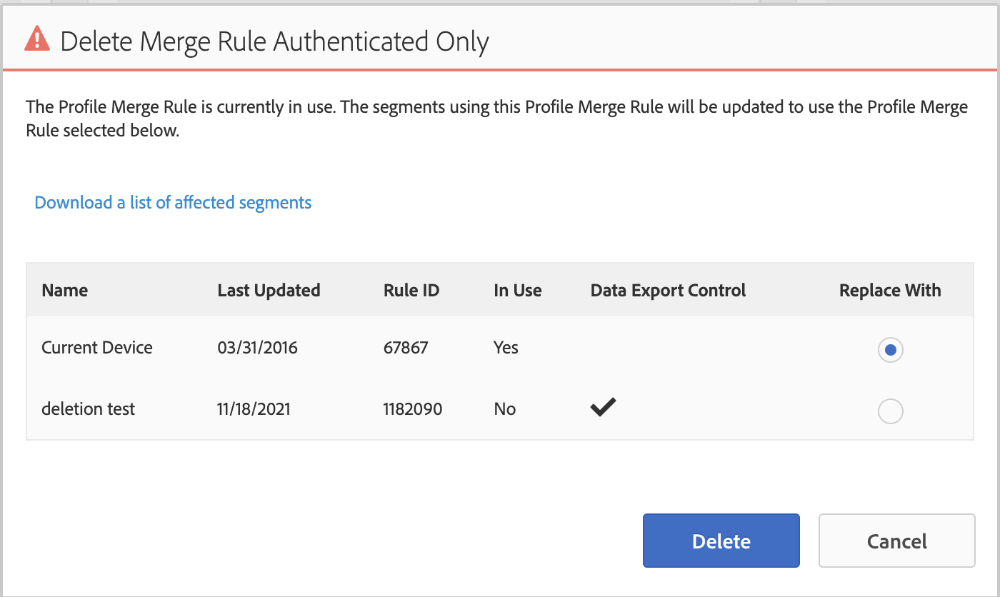

# Pôr do sol do Device Co-op

A partir de 31 de agosto de 2022, o device co-op será oficialmente descontinuado. Este artigo descreve os impactos do usuário e as etapas necessárias.

## Descrição {#description}

### Ambiente

Audience Manager

### Problema/Sintomas

A partir de 31 de agosto de 2022, o device co-op será oficialmente descontinuado. Este artigo descreve os impactos do usuário e as etapas necessárias.

## Resolução {#resolution}

O trabalho de desativação do device co-op será iniciado em 31 de agosto de 2022. Embora a opção de selecionar a cooperação possa não ser inicialmente removida da interface do usuário, o próprio gráfico do dispositivo cooperativo será removido, portanto, quaisquer populações de segmentos que utilizem a cooperação podem enfrentar uma diminuição notável no tamanho. Recomendamos que todos os usuários atualizem suas regras de mesclagem de perfis (PMRs) antes de 31 de agosto de 2022.

Para atualizar PMRs, navegue até Dados do público-alvo `>`  Regras de mesclagem de perfis e selecione a regra em questão. Na parte inferior direita da página de visão geral do PMR, você poderá atualizar a seleção de opções do dispositivo:

Selecione &quot;Gráfico do dispositivo de link de perfil&quot; ou &quot;Perfil do dispositivo&quot; para atualizar seu PMR. Mais detalhes sobre as diferenças entre essas duas opções estão disponíveis aqui: [https://experienceleague.adobe.com/docs/audience-manager/user-guide/features/profile-merge-rules/merge-rule-definitions.html?lang=en#device-options](https://experienceleague.adobe.com/docs/audience-manager/user-guide/features/profile-merge-rules/merge-rule-definitions.html?lang=en#device-options)

Se você encontrar problemas ou conflitos ao tentar atualizar seu PMR, é provável que seja devido aos segmentos anexados e aos controles de exportação de dados associados. Nesse caso, recomendamos a criação de um novo PMR de rede (entre em contato com as equipes de suporte para provisionar uma nova regra se você estiver no limite): [https://experienceleague.adobe.com/docs/audience-manager/user-guide/features/profile-merge-rules/merge-rules-start.html?lang=en#profile-merge-rule-setup](https://experienceleague.adobe.com/docs/audience-manager/user-guide/features/profile-merge-rules/merge-rules-start.html?lang=en#profile-merge-rule-setup)

Se o PMR cooperativo antigo não for mais utilizado, é possível excluir a regra. Selecione o PMR recém-criado na etapa anterior quando receber a opção:

Como opção alternativa, a [Ferramenta BAAAM](https://experienceleague.adobe.com/docs/audience-manager/user-guide/reference/bulk-management-tools/bulk-management-intro.html?lang=en) O também pode ser utilizado para atualizar todos os segmentos relevantes do PMR cooperativo antigo para a regra recém-criada: [https://experienceleague.adobe.com/docs/audience-manager/user-guide/reference/bulk-management-tools/bulk-management-intro.html?lang=en#actions-ops](https://experienceleague.adobe.com/docs/audience-manager/user-guide/reference/bulk-management-tools/bulk-management-intro.html?lang=en#actions-ops)

Segmentos criados por um serviço, como públicos-alvo preditivos e públicos-alvo baseados na Experience Cloud (compartilhados do Analytics), não podem ser editados diretamente na interface do usuário ou pela API. Se você encontrar um erro ao tentar excluir seu PMR e mover os segmentos, ou observar problemas com segmentos individuais na ferramenta BAAAM, compile uma lista de IDs de segmentos problemáticos e abra um tíquete com as equipes de suporte. 

Depois de atualizar as regras conforme descrito acima, se desejar que a opção de cooperação seja removida da interface do usuário, abra um tíquete com a ajuda da equipe de suporte e solicite a remoção do device co-op. Além disso, sinta-se à vontade para abrir um tíquete com qualquer pergunta geral ou preocupação relacionada a este artigo ou à descontinuação geral do device co-op.

Consulte as Perguntas frequentes para obter mais detalhes: [https://experienceleague.adobe.com/docs/device-co-op/using/about/device-co-op-eol.html?lang=en](https://experienceleague.adobe.com/docs/device-co-op/using/about/device-co-op-eol.html?lang=en)
