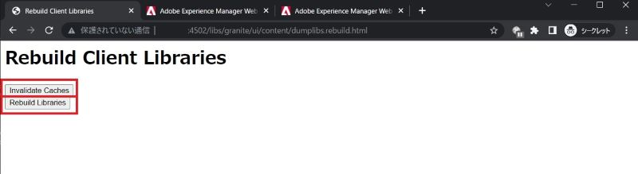

# Adobe Experience Manager: como limpar o cache de HTL/JSP/JS/CSS para componentes personalizados

Quando você modifica arquivos HTL/JSP/JS/CSS para seu componente personalizado, o AEM pode não refletir imediatamente as modificações nas páginas com o componente. O cache interno deve ser o motivo. Este artigo ajudará você a entender como limpar o cache desses arquivos.

## Descrição {#description}

### <b>Ambiente</b>

Experience Manager 6.5

### Problema/Sintomas

Quando você modifica arquivos HTL/JSP/JS/CSS para os componentes personalizados, o AEM pode não refletir imediatamente as modificações nas páginas com o componente. Nesse caso, o cache interno pode ser uma causa.
Saiba como limpar o cache desses arquivos.

## Resolução {#resolution}

Você pode limpar o cache pelas seguintes funções:

1. Bibliotecas de clientes: arquivos JS/CSS

   Reconstruir bibliotecas de clientes > Invalidar caches ou Reconstruir bibliotecas

      http://localhost:4502/libs/granite/ui/content/dumplibs.rebuild.html 

        
2. Carregador de classe do sistema de arquivos: JSP, HTL

   Console da Web > Sling > Carregador de classe do sistema de arquivos > Limpar carregador de classe

      http://localhost:4502/system/console/fsclassloader

        
3. Cache de script: HTL, arquivo JS

   Console da Web > Sling > Status do cache de scripts > Limpar cache

      http://localhost:4502/system/console/scriptcache

        

É recomendável executar a limpeza do cache em um momento de silêncio para evitar a degradação do desempenho.
Talvez também seja necessário verificar o cache do dispatcher e do navegador.
