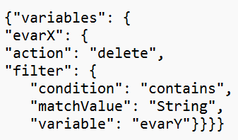

# API de reparo de dados: como filtrar por uma variável diferente da variável de destino?

## Descrição {#description}

Filtros compostos podem ser usados na API de reparo de dados. Por exemplo, exclua evar3 quando evar2=X.
  

## Resolução {#resolution}

A API de reparo de dados permite filtrar variáveis diferentes da variável de destino. Isso não está disponível para todos os clientes. Entre em contato com o Atendimento ao cliente do Adobe para obter mais informações.   <u><b>Sintaxe</b></u>:

<u><b>Nota</b></u>: caso um erro seja visto relacionado à sintaxe da variável de corpo, adicione o parâmetro content-type: application/json header à solicitação de API.