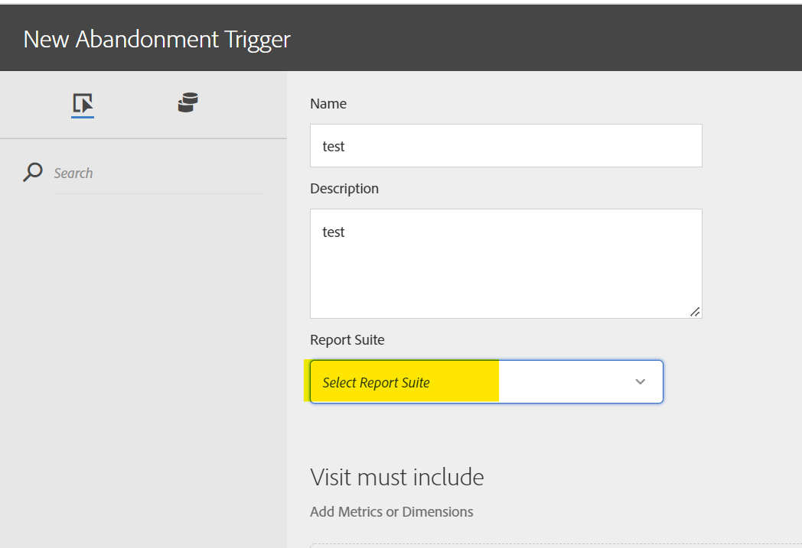

# As IDs dos conjuntos de relatórios não estão disponíveis na lista suspensa na interface do usuário dos acionadores

## Descrição {#description}

<b>Ambiente</b> Analytics   <b>Problema/sintoma</b> Qual pode ser o possível motivo para a ID do conjunto de relatórios não ser preenchida na lista suspensa na interface do usuário dos Acionadores do Experience Cloud?

## Resolução {#resolution}

Isso acontece quando o conjunto de relatórios não é mapeado para a Organização do Experience Cloud. Entre em contato com o Atendimento ao cliente do Adobe para obter mais informações.

  