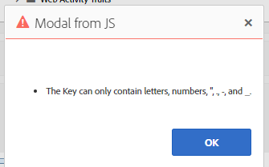

# Erro ao criar nova característica do painel de sinais

Saiba como criar novas características a partir de sinais presentes no Painel de sinais selecionando a condição de sinal correta.

## Descrição {#description}

### Ambiente

Audience Manager

### Problema/Sintomas

Saiba como criar novas características a partir de sinais presentes no Painel de sinais selecionando a condição de sinal correta.

Ao criar novas características a partir de sinais presentes no Painel de sinais, ocorre o erro abaixo.

- Sinal que está sendo usado:

## Resolução {#resolution}

O erro fornecido declara que a chave no sinal só pode conter aspas duplas (&quot;), ponto (.), hífen (-) e sublinhado (_).

Ao observar os sinais de perto, foi identificado que ele contém um espaço, como destacado abaixo, devido à falha na validação de características.

Selecionar a condição de sinal correta é realmente importante.

Referências:

Regras de características- [https://experienceleague.adobe.com/docs/audience-manager/user-guide/features/traits/trait-builder/manage-trait-rules.html?lang=en](https://experienceleague.adobe.com/docs/audience-manager/user-guide/features/traits/trait-builder/manage-trait-rules.html?lang=en)

Requisitos de nome - [https://experienceleague.adobe.com/docs/audience-manager/user-guide/features/traits/trait-key-name-requirements.html?lang=en](https://experienceleague.adobe.com/docs/audience-manager/user-guide/features/traits/trait-key-name-requirements.html?lang=en)
