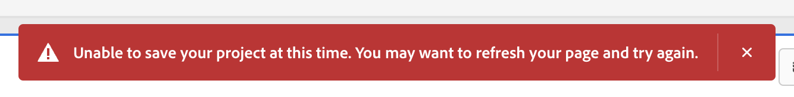

# Adobe Analytics: Falha ao salvar o projeto devido a um erro de rede

## Descrição {#description}

<b>Ambiente</b>
- Adobe Analytics

<b>Problema/Sintomas</b>     A seguinte mensagem de erro é exibida intermitentemente ao tentar salvar o projeto.
  
 &quot;Não é possível salvar o projeto no momento. Talvez você queira atualizar sua página e tentar novamente.&quot;  

## Resolução {#resolution}

O motivo mais provável para isso ocorrer é interrupção da rede. Verifique os IPs e domínios usados pela Adobe Analytics e os remova do filtro no firewall ou proxy em seu ambiente.
 
・IPs e domínios usados pela Adobe Analytics
[https://experienceleague.adobe.com/docs/analytics/technotes/ip-addresses.html?lang=en](https://experienceleague.adobe.com/docs/analytics/technotes/ip-addresses.html?lang=en)
