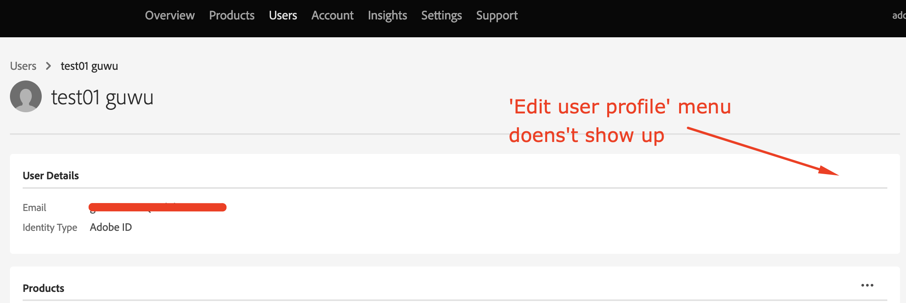

# Como atualizar meu nome de ID de usuário no Admin Console?

Este artigo fornece informações sobre como atualizar o nome da ID de usuário no Admin Console do Adobe.

## Descrição {#description}

### <b>Ambiente</b>

Analytics

### Problema/Sintomas

A ID de usuário (Federated ID, Enterprise ID ou Adobe ID) tem permissão de administrador do sistema, mas a variável <b>Editar perfil de usuário</b> O menu da ID de usuário no Admin Console não está visível. Como atualizar o nome de ID do usuário, `test01 guwu` na imagem a seguir? 

## Resolução {#resolution}

Tipo de ID: Federated ID, Enterprise ID ou Adobe
Peça a outro usuário administrador do sistema em sua organização para atualizar seu perfil de ID. Outros administradores do sistema podem acessar a opção <b>Editar perfil de usuário</b> da sua ID de usuário por meio do Admin Console.

Tipo de ID: Business ID
A opção <b>Editar perfil de usuário</b> não está disponível para usuários com <b>Business ID</b>. Isso significa que esses usuários precisarão atualizar seus perfis [aqui](https://account.adobe.com/profile). Para obter mais informações, consulte como [Atualizar o perfil da conta](https://helpx.adobe.com/br/manage-account/using/edit-adobe-account-personal-profile.html).
 
Referência: consulte o link para obter mais detalhes - [Gerenciar usuários individualmente](https://helpx.adobe.com/br/enterprise/using/manage-users-individually.html)
