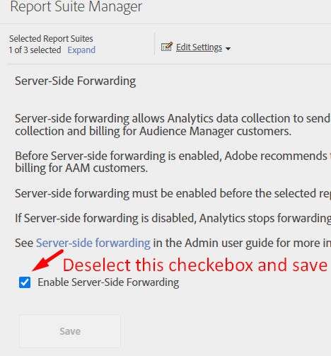

# Como remover chamadas do Audience Manager

## Descrição {#description}

Como faço para remover todos os fluxos de dados ou chamadas do servidor do Audience Manager?

## Resolução {#resolution}

É possível remover completamente o Audience Manager removendo sua associação dos locais abaixo:

1. Remoção do código DIL
2. Remoção do encaminhamento pelo lado do servidor na biblioteca do Adobe Analytics
3. Desfazer a publicação de todos os segmentos do Analytics
4. Interrupção de fluxos de trabalho de importação/exportação no Adobe Campaign
5. Interromper chamadas do Adobe Target
6. Interrupção da assimilação de log do DCM, chamadas de pixel de terceiros
7. Interrupção de todos os seus destinos que estão compartilhando dados com qualquer fornecedor ou terceiro
8. Interrupção de todas as assimilações de dados offline

<b>Remoção do código DIL</b>

1. No código, identifique as seguintes funções e as remova:

   1. DIL.create
   2. DILinstance.api.signals().submit()
   3. DIL.modules.siteCatalyst.init (se estiver encaminhando dados para o Adobe Analytics)
   4. GA.submitUniversalAnalytics(); OU GA.submitUniversalAnalytics(); se estiver encaminhando dados para o Google Analytics
2. Depois de remover a função acima, verifique se a biblioteca DIL JS também foi removida do código.

<b>Resultado</b>: ao publicar novamente e recarregar seu site, você NÃO deve ver nenhuma chamada como [https://subdomain.demdex.net/event?....](https://subdomain.demdex.net/event?....)

<b>Remoção do encaminhamento pelo lado do servidor</b>

1. Acesse os conjuntos de relatórios do Analytics que estão habilitados para o encaminhamento pelo lado do servidor e desabilite a caixa de seleção.

 

1. Depois que a etapa acima for concluída, acesse o código do AppMeasurement.js e remova o código abaixo ou, se utilizar o Launch, basta desmarcar a caixa de seleção de encaminhamento do Audience Manager.

             
<b>Resultado</b>: a resposta da chamada do Analytics deve estar vazia.

<b>Desfazer a publicação de todos os segmentos do Analytics</b>
Acesse os segmentos individuais do Analytics que foram publicados e desfaça a publicação.
<b>Resultado</b>: o compartilhamento de segmentos offline do Analytics para o Audience Manager será interrompido.

<b>Interrupção de fluxos de trabalho de importação/exportação no Adobe Campaign</b>
No Audience Manager: exclua todos os destinos do Campaign
No Campaign: exclua ou interrompa completamente os fluxos de trabalho de importação/exportação na interface do Campaign.
<b>Resultado</b>: segmentos recebidos e enviados do Audience para o Campaign serão interrompidos.

<b>Interrupção de chamadas do Adobe Target</b>
Entre em contato com seu gerente de sucesso do cliente ou gerente de conta para que a equipe de provisionamento desative o recurso “Públicos compartilhados” ou “Serviços principais de pessoas”.
<b>Resultado</b>: o Target não realizará chamadas adicionais para o Audience Manager.

<b>Interromper a assimilação de log do DCM, chamadas de pixel de terceiros</b>
Se a assimilação de log do DCM estiver ativada, desative-a e não faça upload de nenhum arquivo de metadados adicional.
Se você tiver um pixel de impressão/clique/conversões ativo em qualquer lugar, interrompa-o também.
<b>Resultado</b>: não há coleção de dados de terceiros.

<b>Interrupção de todos os destinos que estão compartilhando dados com um fornecedor ou terceiro</b>
Os destinos de URL e cookie podem ser interrompidos diretamente da interface.
Para destinos S2S, é possível entrar em contato com o suporte para interromper os destinos completamente.
<b>Resultado</b>: nenhum dado do Audience Manager será compartilhado.

<b>Interrupção de todas as assimilações de dados offline</b>
Se você estiver carregando algum arquivo de dados no Audience Manager, interrompa o processo imediatamente.
<b>Resultado</b>: nenhum dado offline será carregado.
