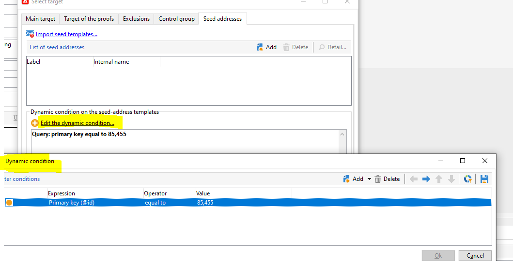

# Os seed addresses são duplicados quando uma entrega recorrente é executada

## Descrição {#description}

Após o cliente adicionar um novo seed address a uma entrega recorrente, toda vez que a entrega recorrente for executada e uma nova instância de entrega for criada, um novo seed address também será criado (com as mesmas características, mas com uma ID/nome interno diferente).      Para observar esse problema:  1. Crie uma nova campanha e, em seu fluxo de trabalho, adicione uma nova entrega recorrente.
 2. Na nova entrega recorrente, adicione um novo seed address e salve. = Na pasta de seed addresses, verifique se o novo seed address foi criado.
 3. Execute a entrega recorrente = Um seed address duplicado será criado e usado na nova instância de entrega.

## Resolução {#resolution}

Isso está funcionando como planejado. Uma solicitação de melhoria foi aberta sob o código [NEO-12892](https://jira.corp.adobe.com/browse/NEO-12892) para mudar isso.

Enquanto isso, os clientes devem usar seeds com condições dinâmicas para evitar a duplicação:

