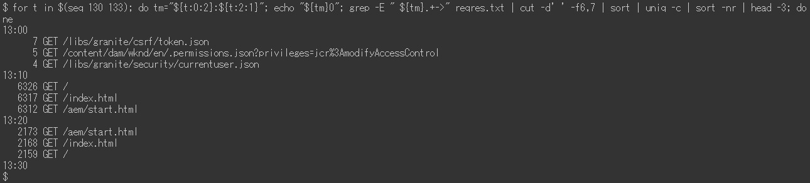

# Exemplos de análise request.log | AEM

## Descrição {#description}

### <b>Ambiente</b>

Experience Manager 6.5

### <b>Problema/Sintomas</b>

O Adobe Experience Manager (AEM) `request.log` O contém várias informações úteis, como tempo de resposta, para analisar os problemas de desempenho. Esta é uma lista de exemplos de análise usando comandos do Linux (incluindo alguns comandos externos, como ruby) `[` 1`]`  e datamash `[` 2`]` ).

<u>Guias de instalação</u>

`[` 1`]`  [https://www.ruby-lang.org/en/documentation/installation/](https://www.ruby-lang.org/en/documentation/installation/)

`[` 2`]`  [https://www.gnu.org/software/datamash/download/](https://www.gnu.org/software/datamash/download/)

## Resolução {#resolution}

### Sumário

<b>A. Introdução</b>

- Formato de `request.log`

<b>B. Etapas de preparação</b>

1. Limpeza de dados
2. Hora de reinício
3. Número de acessos por hora
4. Processamento simultâneo máximo
5. Dividir um arquivo de log
6. Mesclar registros de solicitação e registros de resposta

<b>C. Exemplos de análise</b>

1. Os acessos mais pesados
2. Acessos sem resposta
3. Acesso lento
4. Dados de série temporal do tempo de resposta
5. Tempo de resposta mínimo, médio, mediano e máximo
6. Número de acessos por período
7. Número de status de resposta por período
8. URLs mais frequentes
9. `access.log` registros para uma `request.log` gravar

<b>D. Conclusão</b>

#### <b>A. Introdução</b>

<u>O formato do request.log</u>:

O AEM 6.5 gera `request.log` no formato a seguir por padrão. Devido a uma limitação do sistema, as linhas de comando neste artigo são mostradas como imagens em vez de texto sem formatação.

Exemplo de `request.log`:

Neste artigo, uma linha com &quot;-`>` &quot; é chamado de &quot;registro de solicitação&quot;.&quot; Uma linha com &quot;`<` -&quot; é um &quot;registro de resposta&quot;.

<u>Registro de solicitação</u>:

Quando uma solicitação é recebida pelo AEM, um registro de solicitação é registrado. Ela contém a data e a hora do recebimento, o ID da solicitação, o método de solicitação e o URL.

<u>Registro de resposta</u>:

Quando o AEM responde a uma solicitação, um registro de resposta é registrado. Ele contém a data e a hora da resposta, a ID da solicitação, o código do status, o Content-Type e o tempo de resposta (em milissegundos).

Encontre o manual correspondente em [Interpretando o request.log](https://experienceleague.adobe.com/docs/experience-manager-65/deploying/configuring/monitoring-and-maintaining.html#interpreting-the-request-log).

#### <b>B. Etapas de preparação</b>

<u>Etapa 1. Limpeza de dados</u>

Antes de mergulhar na análise de `request.log`, é importante padronizar os registros de log.

O primeiro `sed` O comando remove um espaço extra no tipo de conteúdo dos registros de resposta, para evitar a separação incorreta de campos com espaços em branco. O comando ruby (consulte <b>`[` 1`]` </b> acima para instalar o Ruby) converte o formato de data para ISO 8601. O comando ruby também separa data e hora com espaço em branco em vez de dois-pontos.

<u>Etapa 2. Hora de reinício</u>

Reiniciar o AEM e uma instalação de service pack redefine o ID da solicitação de `request.log`. A solicitação registra com a solicitação `ID = 0` indica que pode haver esses tipos de operação.

No exemplo acima, as IDs de solicitação eram redefinidas como 0 a 13:08:49 e 13:26:13.

<u>Etapa 3. Número de acessos por hora</u>

Conte o número de acessos por hora e o intervalo de tempo do `request.log`.

<u>Etapa 4. Processamento simultâneo máximo</u>

O número de processamento simultâneo ajuda a adivinhar a carga do servidor de AEM.

Por padrão, o número máximo de conexões simultâneas para o Jetty no AEM é definido como 200. Há um atraso na liberação do soquete após concluir a resposta. Quando o número de processamentos simultâneos exceder aproximadamente 170, ele não poderá mais aceitar novas solicitações.

<u>Etapa 5. Dividir um arquivo de log</u>

A ID da solicitação de `request.log` é redefinido quando o AEM é reiniciado ou um Service Pack é instalado. Devido a esse comportamento, a análise pode estar incorreta quando um `request.log` contém tais operações. Para executar uma análise precisa e reduzir o tamanho do arquivo manipulado de uma só vez, divida o `request.log` usando registros de solicitação com a solicitação `ID = 0`.

<u>Etapa 6. Mesclar registros de solicitação e registros de resposta</u>

A mesclagem de registros de solicitação e resposta pela ID de solicitação facilita a identificação do início dos problemas de desempenho. Esse arquivo de log mesclado será usado nos exemplos posteriores.

O último `sed` O comando adiciona uma resposta fictícia aos registros de solicitação que não têm um registro de resposta correspondente. Também pode haver registros de resposta sem registros de solicitação. Mas eles são ignoráveis, pois normalmente não são um assunto para investigação.

O arquivo de log mesclado deve ter esta aparência:

#### <b>C. Exemplos de análise</b>

<u>Exemplo 1. Os acessos mais pesados</u>

Classifique o arquivo de log mesclado por tempo de resposta em ordem decrescente, incluindo acessos sem resposta.

<u>Exemplo 2. Acessos sem resposta</u>

Acessos de extração não têm os registros de resposta correspondentes usando o tempo de resposta de teste.

Se o tempo de recebimento de acessos sem resposta estiver correlacionado com um aumento na carga do servidor, esses acessos podem ter causado problemas de desempenho.

<u>Exemplo 3. Acesso lento</u>

Extrair acessos que levaram mais de 10 segundos.

Quando o número de ocorrências for muito alto, substitua `[ 0-9] {5}` com `[ 0-9] {6}` no `grep` para restringir a acessos que levaram mais de 100 segundos.

<u>Exemplo 4. Dados de série temporal do tempo de resposta</u>

Extrair apenas o carimbo de data e hora e o tempo de resposta dos dados é útil para criar gráficos.

Omitir os acessos que responderam imediatamente torna os dados mais eficientes. O exemplo a seguir extrai um acesso que levou mais de um segundo.

<u>Exemplo 5. Tempo de resposta mínimo, médio, mediano e máximo</u>

O exemplo acima usa o comando datamash (https://www.gnu.org/software/datamash/) para processamento estatístico. Se o log contiver acessos sem resposta, o valor fictício influenciará o resultado.

<u>Exemplo 6. Número de acessos por período</u>

Conte o número de acessos por dez minutos. O resultado ajuda a determinar se um tráfego grande causou um problema de desempenho.

O exemplo a seguir restringe os dados somente a solicitações POST. Um caso de uso típico é determinar se há uma concentração de criação ou replicação de conteúdo no nível de publicação.

<u>Exemplo 7. Número de status de resposta por período</u>

Crie uma tabela do número de cada status de resposta por dez minutos com o comando datamash.

<u>Exemplo 8. URLs mais frequentes</u>

Imprima os três principais URLs que foram acessados com mais frequência a cada dez minutos.

<u>Exemplo 9. registros access.log para um registro request.log</u>

Pesquisar `access.log` para registros que correspondem a uma ID de solicitação específica.

Se vários acessos ao mesmo URL ao mesmo tempo acontecerem, o resultado mostrará vários `access.log` registros para uma única ID de solicitação.

#### <b>D. Conclusão</b>

Os exemplos neste artigo devem ajudar você a analisar seus problemas de desempenho.

Os exemplos listados foram testados no CentOS 7.5 e no Ubuntu 22.04LTS, mas podem não funcionar conforme esperado dependendo do seu ambiente, como versões diferentes ou variações dos comandos. Ajuste-os de acordo com os comandos instalados em seu ambiente.
