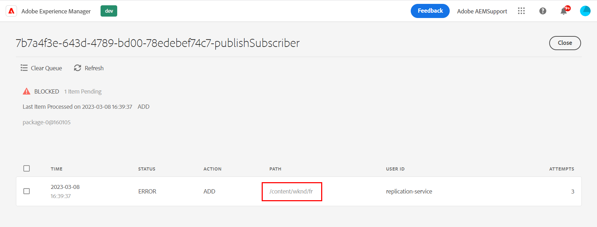

# Fila de Distribuição bloqueada com AccessDeniedException

Ao tentar replicar o conteúdo da página, XF ou outros recursos usando a Publicação rápida, Gerenciar publicação ou Replicar, a Fila de distribuição no Autor é bloqueada. Você pode verificar isso marcando a opção *publicar* Fila de distribuição na interface do usuário de distribuição (<b>AEM `>`  Ferramentas `>`  Implantação `>`  Distribuição</b>). Siga as etapas fornecidas neste documento para resolver o problema.

## Descrição {#description}

### <b>Ambiente</b>

- Experience Manager
- Experience Manager as a cloud service

### <b>Problemas/Sintomas</b>

Ao tentar replicar algum conteúdo da página (ou XF e outros tipos de recursos) usando as opções &quot;Publicação rápida&quot;, &quot;Gerenciar publicação&quot; ou &quot;Replicar&quot;, a fila de distribuição do autor é exibida <b>Bloqueado</b>.

Isso pode ser observado verificando o *publicar*Fila de distribuição na interface de distribuição (AEM - Ferramentas - Implantação - Distribuição):
       Selecionar a fila Golden Publisher (entrada em negrito da lista), mais detalhes são fornecidos e, em particular, o envolvido <b>CAMINHO</b> (pode haver vários elementos aqui):       Examinando o <b>Logs</b> mostrará o seguinte erro correspondente:  03/2023/08 12:11:26:238 - INFO - Solicitação aceita com pacote de distribuição PackageMessage(pubSlingId=a1133c97-6809-411e-a435-4eea0ecbe889, reqType=ADD, pkgId=dstrpck-1678277486031-63159f4b c577-4079-8741-d41660597d20, pkgType=journal_filevault, pkgLength=6330, pubAgentName=publish, userId=replication-service, paths=`[` /content/wknd/fr`]` , deepPaths=`[` `]` ) no offset=158705
 03/2023/08 12:11:27:459 - WARN - Mensagem: Falha na tentativa (0/infinito) de importar o pacote de distribuição PackageMessage(pubSlingId=a1133c97-6809-411e-a435-4eea0ecbe889, reqType=ADD, pkgId=dstrpck-1678277486031-6 3159f4b-c577-4079-8741-d41660597d20, pkgType=journal_filevault, pkgLength=6330, pubAgentName=publish, userId=replication-service, paths=`[` /content/wknd/fr`]` , deepPaths=`[` `]` ) no offset=158705 devido a &quot;javax.jcr.AccessDeniedException: OakAccess0000: acesso negado&quot;, o importador tentará novamente mais tarde,
 Stacktrace: org.apache.sling.distribution.common.DistributionException: javax.jcr.AccessDeniedException: OakAccess000: acesso negado
 `[` ..`]`       Você precisa *Limpar fila* (ou remover esse item) para desbloquear a fila. 

## Resolução {#resolution}

Apesar de o erro ser <b>`javax.jcr.AccessDeniedException`</b>, possivelmente, não há relação com a ACL / permissões para os usuários do serviço de distribuição, embora isso deva ser considerado se o cenário a seguir não se aplicar ao seu caso.

Diagnóstico

O erro acima pode ocorrer em alguma situação, quando o conteúdo replicado tem uma configuração específica relacionada ao especial <b>jcr:lockIsDeep</b> propriedade.

Para confirmar o diagnóstico, é necessário inspecionar <b>cada um dos caminhos mencionados</b> com qualquer uma das seguintes ferramentas que você pode acessar/é aplicável:

1. CRX/DE para instâncias DEV
2. o [Navegador do repositório](https://experienceleague.adobe.com/docs/experience-manager-cloud-service/content/implementing/developer-tools/repository-browser.html?lang=pt-BR)
3. criar um pacote de conteúdo no Gerenciador de pacotes (essa opção também faz parte da resolução)

Em seguida, é necessário verificar o <b>`jcr:content`</b> para cada caminho encontrado na interface do usuário da fila de distribuição e verifique se:

- É <b>faz </b>têm um <b>`jcr:lockIsDeep`=&quot;(Booleano)true&quot;</b> propriedade
- É <b>não </b>têm um <b>`jcr:lockOwner="xxx"`</b> propriedade
- <b>(</b>it <b>não</b> têm um <b>`mix:lockable`</b> valor no <b>`jcr:mixinTypes`</b>)

Se esse for o caso, o problema será confirmado, já que a variável <b>`jcr:lockIsDeep`</b> a propriedade não deve estar presente sozinha. Essa propriedade deve ser sempre definida juntamente com o <b>`jcr:lockOwner`</b> quando <b>Bloqueio</b> uma página.

Não é possível definir apenas o <b>`jcr:lockIsDeep`</b> propriedade, mesmo usando a API JCR, de modo que a causa principal que explica essa situação é principalmente ter instalado uma *corrompido* pacote de conteúdo com essa única propriedade.

<u><b>Resolução</b></u>

Para corrigir o conteúdo, a única solução é instalar um pacote no Autor que tenha as propriedades corretas definidas no nó correspondente.

É possível criar esse pacote a partir de outra instância com o conteúdo correspondente ou, se você tiver apenas esse conteúdo na instância afetada, siga estas instruções:

1. Gerar um pacote na instância corrompida para a página com falha
2. Baixar o pacote
3. Extraia o <b>`.content.xml`</b> para página/jcr:content
4. Remova manualmente a linha com a <b>jcr:lockIsDeep</b>
5. Atualize seu pacote com o arquivo novo/corrigido .content.xml
6. Recarregue e instale o pacote modificado

Verifique novamente as propriedades da página e teste com êxito a replicação/distribuição.
