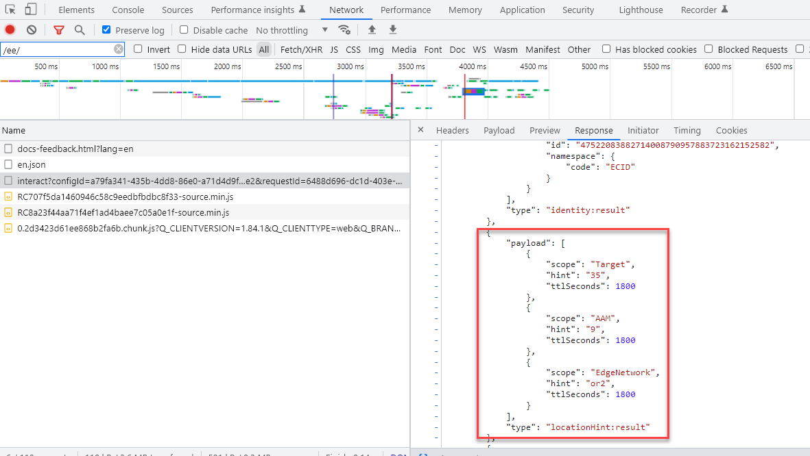

# Dicas de localização de Experience Platform, nós regionais AAM DCS e dicas de localização do serviço de ID

## Descrição {#description}

Qual é a relação entre as Dicas de localização do AEP WebSDK, as Dicas de localização do Serviço de ID de Experience Cloud e AAM nós regionais do DCS e por que é importante entender essa relação?

## Resolução {#resolution}

O AEP WebSDK (que envia dados para o Experience Edge) e a coleta de dados em tempo real do Adobe Audience Manager (AAM) ocorrem em nós regionais dispersos no mundo inteiro. Há 7 nós regionais e AEP WebSDK/Experience Edge e AAM coleta de dados usa os mesmos nós. AAM Servidores de coleta de dados (DCS) utilizam a mesma infraestrutura de rede que compõe o Experience Edge. Da mesma forma, como o serviço de Experience Cloud ID utiliza AAM tecnologia, as dicas de localização do serviço de ID são as mesmas que os nós de coleta de dados regionais AAM. Em outras palavras, AAM nós DCS = Dicas de localização do serviço de ID = Dicas de localização da borda da experiência. AAM nós regionais são descritos nesta seção [documentação](https://experienceleague.adobe.com/docs/audience-manager/user-guide/api-and-sdk-code/dcs/dcs-api-reference/dcs-regions.html?lang=en), considerando que os nós regionais do mesmo Experience Edge são descritos nesta seção [documentação](https://experienceleague.adobe.com/docs/experience-platform/edge-network-server-api/location-hints.html?lang=en).

Embora AAM nós regionais e dicas de localização do serviço de ID sejam identificadas por números e os da Experience Edge sejam identificados por caracteres alfanuméricos, você observará que todos estão alinhados às mesmas áreas (exceto o Brasil).  A tabela de pesquisa abaixo demonstra como eles se alinham:

| Dica de localização da borda da experiência | Dica de localização do nó/serviço de ID da região do AAM DCS |
| --- | --- |
| spg3 | ID: 3 Host: apse.demdex.net |
| irl1 | ID: 6 Host: irl1.demdex.net |
| va6 | ID: 7 Host: use.demdex.net |
| aus3 | ID: 8 Host: apse2.demdex.net |
| or2 | ID: 9 Host: usw2.demdex.net |
| jpn3 | ID: 11 Host: tyo3.demdex.net |
| ind1 | ID: 12 Host: ind1.demdex.net |

A maioria das funcionalidades do Adobe Experience Cloud que requer respostas em tempo real utiliza esses nós regionais. O primeiro serviço de ID de chamada ou a chamada do Experience Edge em uma página da Web ou aplicativo móvel determina qual nó regional usar. As dicas de localização podem ser encontradas em resposta a estas chamadas:

Serviço da Experience Cloud ID:

AEP Web SDK:

Depois que o nó regional mais próximo do usuário final é determinado, o identificador de região é passado por meio das chamadas do Analytics, Target e AEP WebSDK. No Analytics, ele é passado como o parâmetro de sequência de consulta aamlh:

No Target, ele é transmitido no objeto experienceCloud.audienceManager.locationHint da carga da solicitação:

Para o SDK da Web da AEP, o caminho da chamada é atualizado para refletir o nó regional:

<b>Observação: </b>A primeira chamada interativa do AEP WebSDK NÃO terá a região no caminho porque a região ainda não foi determinada, mas a dica de localização estará na resposta (como observado acima). O caminho da solicitação original será apenas ..../ee/v1/.... No entanto, as chamadas subsequentes incluirão as informações do nó regional entre os elementos de caminho /ee/ e /v1/

Esses parâmetros garantem que os dados encaminhados do lado do servidor do Analytics sejam encaminhados para o nó de borda AAM correto, que o Target solicite informações do segmento a partir desse mesmo nó de borda e que [Os dados da AEP enviam dados para AAM](https://experienceleague.adobe.com/docs/audience-manager/user-guide/implementation-integration-guides/integration-experience-platform/aam-aep-audience-sharing.html?lang=en) (e da biblioteca de público-alvo) corrigir o nó regional.

Essas informações são importantes ao enviar hits do lado do servidor ou do lado do cliente para soluções Adobe não padrão. Por exemplo, uma chamada AEP WebSDK construída manualmente em uma página exclusivamente para sincronizar uma ECID com um perfil AEP precisa ser enviada para o nó regional correto da Experience Edge. Caso contrário, quaisquer dados compartilhados da AEP para o AAM irão para o banco de dados de back-end AAM e levarão mais 48 horas para AAM os dados serem encaminhados para cada nó de borda, reduzindo drasticamente o tempo que o Target poderia usar qualquer segmento da AEP enviado para o AAM (ou Biblioteca de público-alvo). Ou se uma solicitação do Analytics do lado do servidor for enviada para o nó 7, mas a implementação do Target na página do usuário usar a região 9, os dados serão encaminhados para AAM nó Leste dos EUA, enquanto o Target está fazendo ping no nó Oeste dos EUA para obter informações do segmento. O usuário final não poderia se qualificar para nenhuma atividade do Target usando públicos/segmentos de AAM da Biblioteca de público-alvo até que os nós finais fossem sincronizados 24 a 48 horas depois. É uma prática padrão em casos de uso como esses para obter a ECID usando o [getMarketingCloudVisitorID](https://experienceleague.adobe.com/docs/id-service/using/id-service-api/methods/getmcvid.html?lang=en) (serviço de ID) ou [getIdentity](https://experienceleague.adobe.com/docs/experience-platform/edge/extension/accessing-the-ecid.html?lang=en) (SDK da Web). No entanto, além de obter a ECID, a dica de localização também deve ser recuperada e usada usando o [getLocationHint](https://experienceleague.adobe.com/docs/id-service/using/id-service-api/methods/getlocationhint.html?lang=en) (Serviço de ID) ou recuperando a partir da carga de resposta das chamadas de SDK da Web.

