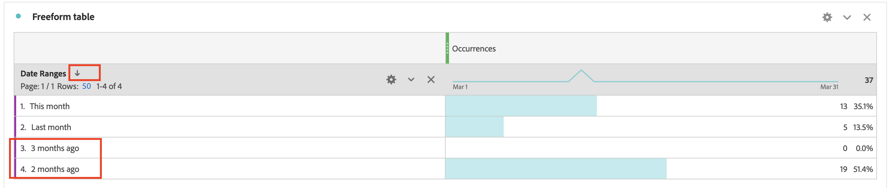

# Como classificar manualmente a ordem do Dimension de Intervalo de datas no relatório do Workspace

Este artigo aborda problemas de classificação com Dimension de intervalo de datas no Adobe Analytics Customer Journey Analytics. A solução alternativa envolve o uso do recurso &quot;Criador de tabela&quot; para reordenar manualmente as dimensões, permitindo a classificação personalizada, como &quot;Este mês&quot; `>`  &quot;Último mês&quot; `>`  &quot;2 meses atrás&quot; `>`  &quot;3 meses atrás&quot;.

## Descrição {#description}

<b>Ambiente</b>
Customer Journey Analytics Adobe Analytics

<b>Problema</b>
Você deseja classificar os Dimension do intervalo de datas na ordem de &quot;Este mês&quot; &quot;Último mês&quot; &quot;2 meses atrás&quot; &quot;3 meses atrás&quot;.

No entanto, ao clicar no ícone de classificação, ele é exibido em ordem diferente.
   Como você pode classificar manualmente a ordem dos Dimension?  
            

## Resolução {#resolution}

Você pode ordenar manualmente os Dimension com o recurso &quot;Criador de tabela&quot;.

Abra a Tabela de forma livre e clique no botão &quot;Habilitar construtor de tabela&quot;.

Solte os Dimension na tabela na ordem desejada e clique no botão Criar

Agora os Dimension estão ordenados na ordem que você definiu &quot;Este mês&quot; &quot;Último mês&quot; &quot;2 meses atrás&quot; &quot;3 meses atrás&quot;

