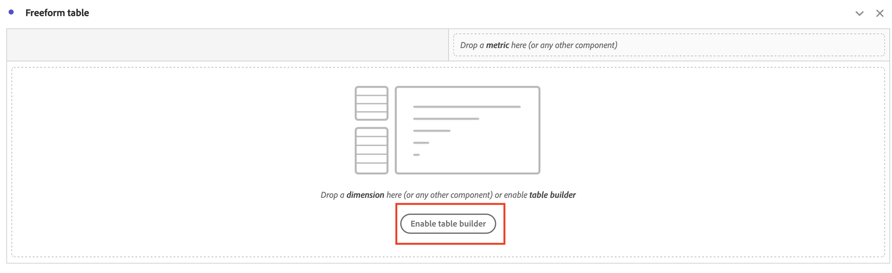

# Como classificar manualmente a ordem de Dimension do Intervalo de datas no relatório do Workspace?

## Descrição {#description}

Problema:
  
 Quero classificar os Dimension de Intervalo de Datas na ordem de &quot;Este Mês&quot; &quot;Último Mês&quot; &quot;2 meses atrás&quot; &quot;3 meses atrás&quot;.  No entanto, ao clicar no ícone de classificação, ele é exibido em ordem diferente. Como posso classificar manualmente o pedido de Dimension?  
            

## Resolução {#resolution}

Você pode ordenar manualmente os Dimension com o recurso &quot;Criador de tabela&quot;.

Abra a Tabela de forma livre e clique no botão &quot;Ativar construtor de tabela&quot;

Solte Dimension na tabela na ordem desejada e clique no botão Criar

Agora, as Dimension são classificadas na ordem em que você definiu &quot;Este mês&quot; &quot;Último mês&quot; &quot;2 meses atrás&quot; &quot;3 meses atrás&quot;

