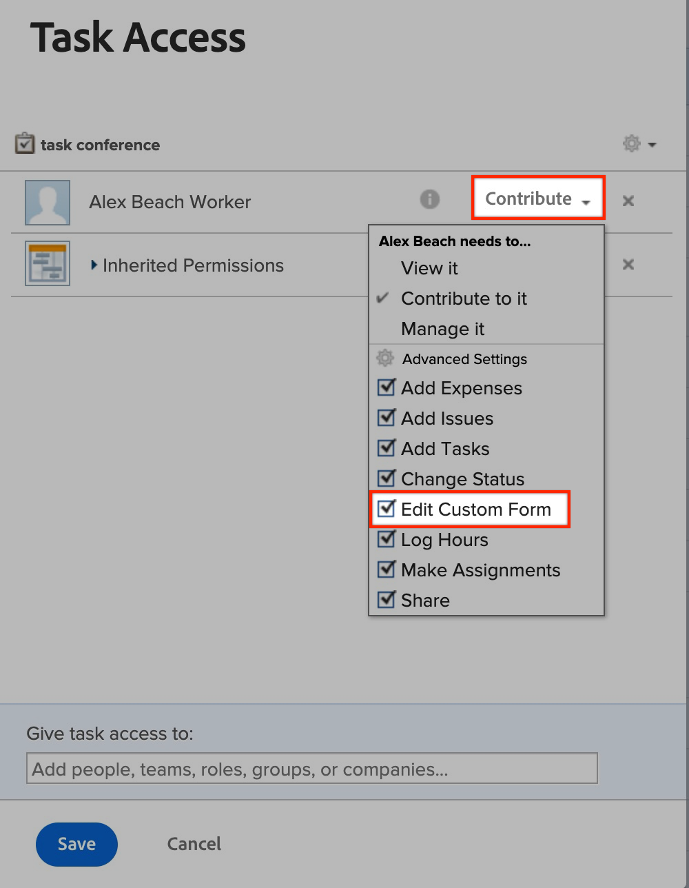

# Não é possível editar campos personalizados | Workfront

## Descrição {#description}

<b>Ambiente</b>
Workfront

<b>Problema/Sintomas</b>
Há diferentes cenários em que um usuário pode encontrar problemas com a edição de campos personalizados. Por exemplo, ao enviar uma solicitação, ao exibir um formulário personalizado em um objeto ou ao exibir campos personalizados em um relatório.

## Resolução {#resolution}

<b>Etapa para resolver:</b>
1. Verifique se o formulário que contém o campo está anexado ao objeto que está tentando editar.
   1. Se um usuário não administrador quiser anexar um formulário ao objeto, ele precisará gerenciar o acesso ao objeto para anexar o formulário.
2. Verifique se todos os detalhes no compartilhamento de formulário estão corretos.
   1. Abra o <b>Compartilhamento</b> configurações para o objeto ao qual o formulário está anexado. Consulte abaixo:
   2. Procure o usuário afetado no <b>Compartilhamento</b>menu.
      - Se o usuário não estiver listado, adicione-o à <b>Compartilhamento</b> menu.
   3. Certifique-se de que o usuário tenha a variável <b>Contribute</b> com a <b>Editar formulário personalizado</b> habilitado na <b>Configurações avançadas. </b>Consulte abaixo:
   4. <b>(Esta etapa é opcional) </b>Se este formulário fizer parte de um<b> Fila de solicitações, </b>verifique as configurações de compartilhamento no<b> Fila de solicitações </b>formulários personalizados, também. Consulte abaixo:

Para obter mais informações, abra os seguintes links:

- [Editar informações em campos de formulário personalizados](https://experienceleague.adobe.com/docs/workfront/using/basics/work-with-custom-forms/edit-custom-forms.html?lang=en)
- [Criar uma fila de solicitações](https://experienceleague.adobe.com/docs/workfront/using/manage-work/requests/create-and-manage-request-queues/create-request-queue.html?lang=en)

