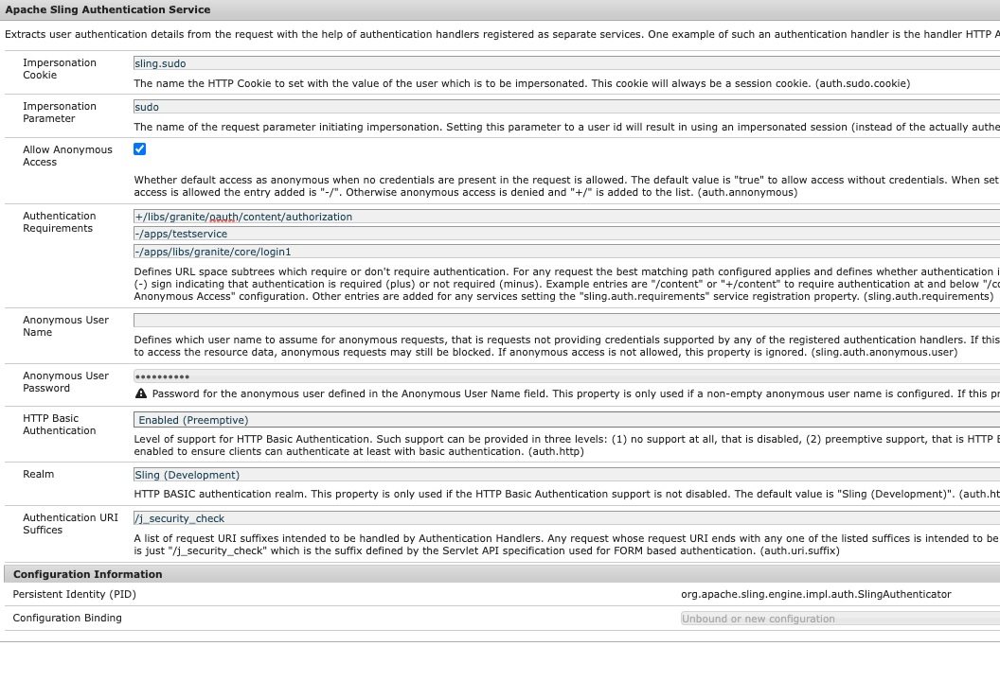

# Como redirecionar para página de logon personalizada em caso de falha AEM fluxo do OAuth

## Descrição {#description}

<b>Ambiente</b>
Experience Manager

<b>Problema/Sintomas</b>
Como redirecionar para a página de logon personalizada em um ambiente de publicação do Adobe Experience Manager (AEM) no caso de falha de fluxo AEM Autorização aberta (OAuth)?

## Resolução {#resolution}

No caso do fluxo SAML (Security Assertion Markup Language)/OAuth, se houver um erro no fluxo de autenticação de AEM, o sistema redirecionará para a página de logon padrão Pronto para uso (OOTB) AEM.

Portanto, é necessário redirecionar os usuários para a página de logon personalizada do SAML/OAuth IDP. Siga as etapas abaixo:

1. Copiar este caminho de nó */libs/granite/core/content/login* para */apps/granite/core/content/login1* como abaixo.
2. Alterar o tipo de recurso de */apps/granite/core/content/login1* para <b>testservice</b>, conforme mostrado abaixo:
3. Crie um `rep:policy` nó em login1 com <b>permitir filho</b>, conforme mostrado abaixo:
4. Crie um <b>testservice</b> pasta em <b>/apps</b> e adicionar <b>sling:resourceType</b> com <b>testservice</b> e criar um arquivo JSP chamado <b>testservice.jsp</b>, conforme mostrado abaixo:
5. Abra a configuração do OSGI <b>Manipulador de autenticação do seletor de logon do Adobe Granite</b> e altere a Página de logon padrão para */apps/granite/core/content/login1* e personalize a `auth.loginselector.mappings` propriedade para apontar para minha página de logon sobreposta para seu caminho seguro. Consulte abaixo:
6. Abra a configuração do OSGI <b>Serviço de autenticação do Apache Sling</b> e adicionar *-/apps/granite/core/content/login1* e *-/apps/testservice* para `sling.auth.requirements` lista. Consulte abaixo:

