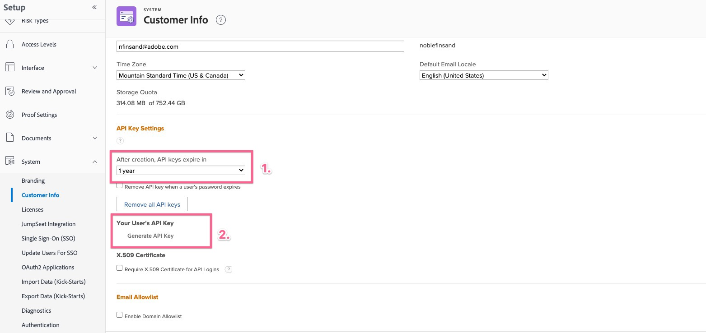

# Erro de solicitação incorreta ao configurar o complemento Workfront para Jira

Você vê um erro de solicitação incorreto ao tentar estabelecer uma conexão entre o Workfront e o Jira. Para resolver o problema, verifique a presença e a data de expiração da chave de API no <b>Configurações da chave de API</b> no Workfront.

## Descrição {#description}

### <b>Ambiente</b>

Workfront

### <b>Problema/Sintomas</b>

Um erro de solicitação incorreto está presente ao tentar estabelecer uma conexão entre o Workfront e o Jira quando não há uma chave de API válida definida no Workfront para o usuário.

## Resolução {#resolution}

<b>Etapas para resolver:</b>
1. Faça logon no <b>Workfront</b>, você deseja estabelecer a conexão com o como um usuário.
2. Navegue até a <b>Configuração</b>.
   - Ir para <b>Sistema</b> `>`  <b>Informações do cliente</b> no <b>Workfront</b>.
   - Verifique se um *Chave de API* está presente no <b>Configurações da chave de API</b> seção.
3. Se um *Chave de API* não está presente:
   - Defina uma data de expiração e clique em <b>Gerar</b>.
4. Se uma chave de API já estiver presente:
   - Verifique a duração do período definido antes da *a chave irá expirar* e clique em <b>Redefinir</b>.
5. Ir para <b>Jira</b> e tente se reconectar ao <b>Workfront</b>.

### <b>Links relevantes:</b>

- [Configurar Adobe Workfront para Jira](https://experienceleague.adobe.com/docs/workfront/using/adobe-workfront-integrations/workfront-for-jira/configure-workfront-for-jira.html?lang=en)
- [Gerenciar chaves de API no Workfront](https://experienceleague.adobe.com/docs/workfront/using/administration-and-setup/manage-wf/security/manage-api-keys.html?lang=en)
