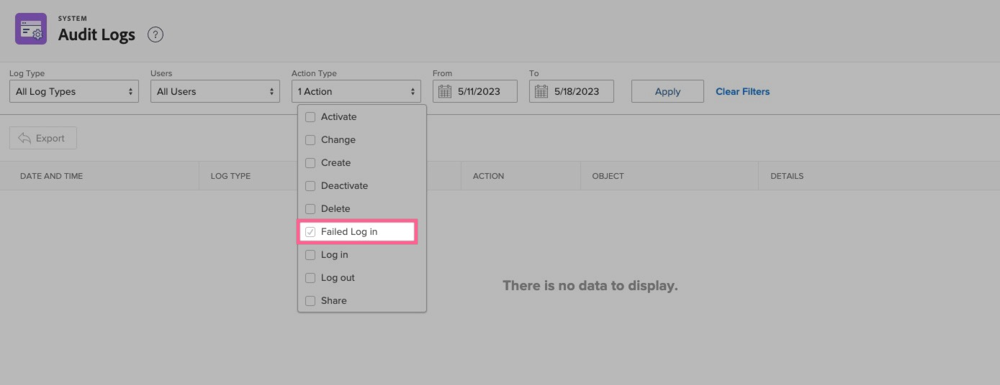
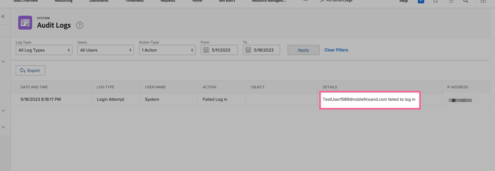

# Erro de login como usuário não mapeado SSO (login único)

Para resolver o erro de logon, verifique a Federation ID listada na conta do Workfront e use os logs de auditoria como uma ferramenta de solução de problemas.

## Descrição {#description}

### Ambiente

Workfront

### Problema/Sintomas

Ao tentar fazer logon por meio do Workfront usando o Logon único (SSO), a página é redirecionada para a página de logon do Workfront. Na barra de endereços da Web da página de logon, é exibida a mensagem de erro &quot;usuário não mapeado&quot;.

## Resolução {#resolution}

1. Navegue até o usuário específico que está recebendo este erro no Workfront:
   - [Editar Usuário](https://experienceleague.adobe.com/docs/workfront/using/administration-and-setup/add-users/create-manage-users/edit-a-users-profile.html?lang=en).
   - Se não houver uma conta de usuário presente, [criar um novo usuário](https://experienceleague.adobe.com/docs/workfront/using/administration-and-setup/add-users/create-manage-users/add-users.html?lang=en) conta.
2. Verifique se o usuário tem uma Federation ID listada:
   - Verifique a ID da Federação.
3. Se a ID da Federação estiver em branco, siga estas etapas:.
   - Insira a ID da Federação do usuário (diferencia maiúsculas de minúsculas) fornecida pelo seu Provedor de Identidade.
   - Clique em <b>Salve.</b>
   - Observação: a ID da Federação diferencia maiúsculas de minúsculas e deve corresponder exatamente à forma como é enviada para a Workfront a partir do seu Provedor de Identidade. Se não tiver certeza sobre a ID da Federação ou sua diferenciação entre maiúsculas e minúsculas, consulte o administrador de rede ou de TI.
   - Além disso, verifique se há espaços extras antes ou depois da ID da Federação, pois eles podem ser o motivo desse erro.

Etapas opcionais: Logs de auditoria

Use os logs de auditoria no Workfront como uma ferramenta de solução de problemas para examinar o que seu Provedor de identidade está transmitindo como a ID da Federação (ID de nome) durante a tentativa de logon com falha.

1. Clique em <b>Configuração</b>
2. Ir para o sistema `>`  [Logs de auditoria](https://experienceleague.adobe.com/docs/workfront/using/administration-and-setup/add-users/create-manage-users/audit-logs.html?lang=en)
3. Aplicar filtros para exibir tentativas de logon com falha
   - Filtrar para tentativas de logon com falha 
   - Clique em <b>Aplicar</b>.
4. A ID da Federação (ID de nome) transmitida do Provedor de identidade para a Workfront é exibida na coluna dos detalhes da tentativa de logon com falha recente.
   - Verifique se essa ID da Federação mostrada na coluna dos detalhes corresponde exatamente (diferencia maiúsculas de minúsculas) ao que foi inserido no Workfront como a ID da Federação.
