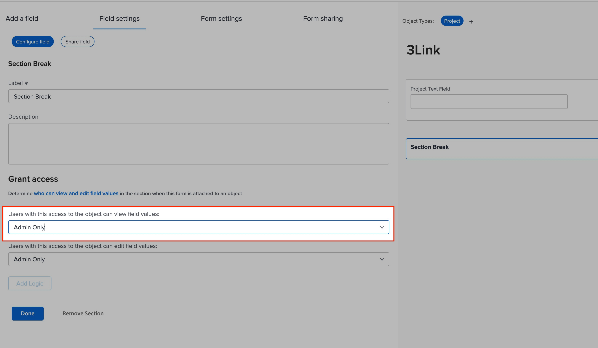

# O campo personalizado não é exibido no formulário

## Descrição {#description}

### <b>Ambiente</b>

Workfront

### <b>Problema/Sintomas</b>

Um campo foi adicionado a um formulário personalizado, no entanto, quando você olha para o formulário, o campo não está visível.

## Resolução {#resolution}

Para resolver o problema, execute as seguintes etapas:

1. Verifique se o campo está no formulário correto.
2. Verifique as quebras de seção.

   - Se houver quebras de seção, verifique o acesso necessário para visualizar os campos na seção.                     
3. Verifique se há Lógica de salto no formulário.                                                                                                                                               
   - Quando a Lógica de salto é implementada, as outras seções estão aguardando que a Lógica de salto seja iniciada, o que pode ocultar essas seções/outros campos.
   - Haverá um símbolo &quot;S&quot; no campo para indicar que um campo tem Lógica de salto.
   - Se a Lógica de salto estiver ocultando o campo, os usuários precisarão preencher os campos obrigatórios para a lógica ser acionada ou talvez seja necessário reconfigurar a lógica no formulário.

<b>Leituras relacionadas:</b>

- [Adicionar lógica de exibição e lógica de salto a um formulário personalizado com o construtor de formulários herdado](https://experienceleague.adobe.com/docs/workfront/using/administration-and-setup/customize/custom-forms/custom-form-builder/use-the-custom-form-builder/display-or-skip-logic-custom-form.html)
- [Adicionar uma quebra de seção a um formulário personalizado com o construtor de formulários herdado](https://experienceleague.adobe.com/docs/workfront/using/administration-and-setup/customize/custom-forms/custom-form-builder/use-the-custom-form-builder/add-a-section-break-to-a-custom-form.htm)
