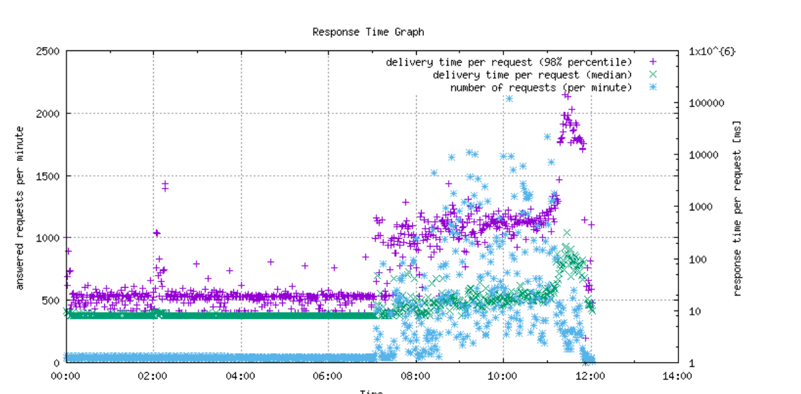

# Análise do arquivo request.log para padrões de tráfego

As etapas a seguir mostram como analisar `request.log` gerando um gráfico de tráfego e, em seguida, gerando referências cruzadas para a saída do `request.log` e `rlog.jar` ferramentas.

## Descrição {#description}

### <b>Ambiente</b>

Adobe Experience Manager

### <b>Problema/Sintomas</b>

Como analisar a `request.log` arquivo para padrões de tráfego?

## Resolução {#resolution}

1. Instalar <b>Perl </b>(Linguagem de programação desenvolvida para manipulação de texto) e <b>Gnuplot </b>(linha de comando portátil) na área de trabalho e para o SO Windows, instale <b>Cygwin </b>(ambiente tipo Unix e interface de linha de comando).

   Ao instalar o <b>Cygwin</b>, inclua <b>Perl </b>e<b> Gnuplot</b> durante a instalação no <b>Selecionar pacotes </b>etapa. No Mac OS(X), instale <b>Brew </b>(sistema de gerenciamento de pacotes de software livre e de código aberto).

   Após a instalação <b>Brew</b>, abra o aplicativo Terminal do Mac e execute <b>Brew </b>para instalar <b>Gnuplot</b>.
2. Baixe os dois arquivos a seguir em uma nova pasta no computador.

   [graph-request-log.pl](https://raw.githubusercontent.com/joerghoh/cq5-utils/master/scripts/request.log/graph-request-log.pl)

   [requestlog.pm](https://raw.githubusercontent.com/joerghoh/cq5-utils/master/scripts/request.log/requestlog.pm)
3. Execute o comando para o caminho de `request.log`: <b> </b>

   `Perl and graph-request-log.pl --title Request Log Graph --output output.png request.log | Gnuplot`.

   O comando produz um arquivo chamado `output.png` semelhante ao seguinte:

Para entender o gráfico acima, é preciso entender o que [mediana](https://www.mathsisfun.com/definitions/median.html) e [percentual](https://www.mathsisfun.com/data/percentiles.html) média. Como mostrado no gráfico, os usuários não usam o sistema até por volta das 7:00 AM. O tráfego acontece por volta das 9h. O tráfego aumenta ainda mais às 11h30 e um pico no número de solicitações e tempos de resposta mais lentos (visíveis pelo tempo de resposta mediano e marcações do percentil 98). Exibir o [Arquivo Readme](https://github.com/joerghoh/cq5-utils/tree/master/scripts/request.log) para obter mais informações sobre a documentação desta ferramenta de gráfico.

1. Agora que o gráfico foi usado para encontrar períodos importantes, faça referência cruzada das horas selecionadas nos arquivos de log (como request.log e error.log). Uma maneira fácil de visualizar arquivos grandes é usar o <b>[menos](https://ja.wikipedia.org/wiki/Less_%28Unix%29)</b>comando no shell (Cygwin no Windows ou Terminal no Mac). Por exemplo, execute este comando <b>menos request.log</b> e pesquisar <b>/2016 11:3`[` 0-9`]` :</b>e pressione <b>Enter</b> para selecionar o período até 11h30 no arquivo e clique em Pesquisar. 
2. Uma referência cruzada nos gráficos em relação à saída do `rlog.jar` aplicativo enviado com AEM em opt/helpers também pode ser feito. As instruções podem ser encontradas em [Documentos do AEM.](https://experienceleague.adobe.com/en/docs/experience-manager-release-information/aem-release-updates/previous-updates/aem-previous-versions)

