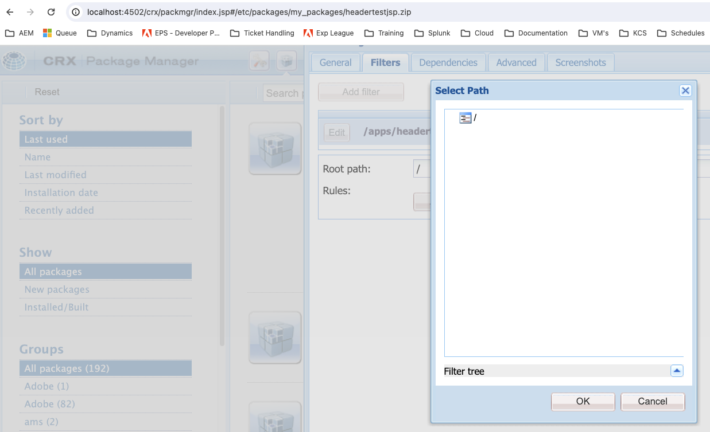

# Não é possível exibir subdiretórios no Gerenciador de pacotes ao criar novos filtros

No Adobe Experience Manager (AEM), os administradores podem encontrar um problema em que os subdiretórios não estão visíveis na interface do usuário do Gerenciador de pacotes ao tentar adicionar novos filtros. Este artigo fornece uma resolução para usuários que precisam criar pacotes que incluem subdiretórios.

## Descrição {#description}

Ao usar o Gerenciador de pacotes AEM para criar novos filtros para um pacote, a interface do usuário só pode mostrar o diretório raiz, impedindo a seleção de subdiretórios.

Após a inspeção dessa janela, você pode ver nas ferramentas do desenvolvedor do navegador que o arquivo /crx/de/tree.jsp não foi encontrado.

Você também verá um erro semelhante ao tentar carregar o aplicativo CRX/DE (ou seja, http://`<` hostname/crx/de/index.jsp).

Esse comportamento pode dificultar a capacidade de criar pacotes abrangentes para implantação ou distribuição.

## Resolução {#resolution}

Para resolver esse problema, siga estas etapas:

1. Acesse seus pacotes (http://localhost:4502/system/console/bundles)
2. Pesquisar por &quot;crx&quot;
3. Certifique-se de que o [CRXDE Lite do Adobe Granite (*com.adobe.granite.crxde-lite)*](http://localhost:4502/system/console/bundles/241) o pacote está em execução
4. Tentar novamente o caso de uso

Seu CSE também pode ativar temporariamente isso para você.

Observação: é política do AMS desativar pacotes CRX/DE em sistemas de produção. É fundamental seguir as práticas recomendadas de segurança ao habilitar o CRX DE Lite em ambientes de produção. O acesso deve ser restrito às tarefas administrativas necessárias e o explorador deve ser desativado imediatamente após o uso.
